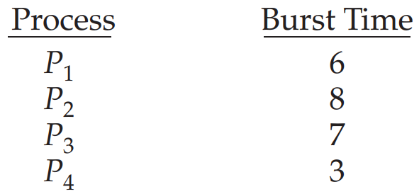

# Chap5 CPU Scheduling

- CPU 스케줄러는 다중 프로그램 운영체제의 기본이다.
    - 운영체제는 CPU를 프로세스 간에 교환함으로써, 컴퓨터를 보다 생산적으로 만든다.
- 최신 운영체제에서는 실질적으로 프로세스가 아니라 커널 수준 스레드를 스케줄 한다.

> **CPU, Core, Processor, Thread 용어 설명**
> 
- **Processor**란 컴퓨터와 전자기기들에 내장된 작은 칩을 말한다.
    - 프로세서의 기본적인 역할은 입력을 받아서 적절한 출력을 제공하는 것이다.
    - 이러한 작업들은 간단한 작업처럼 보일 수 있지만 최신 프로세서는 초당 수 조 개의 계산을 처리할 수 있다.
    - 프로세서의 한 종류로써 마우스 및 키보드 입력 처리, 응용 프로그램 실행과 같은 모든 기본 시스템 명령을 처리하는 컴퓨터의 중앙 프로세서인 CPU(Central Processing Unit)이 있다.
    
- **중앙처리장치(CPU)**는 프로세서의 주된 유형이며, 하나 이상의 코어로 구성된다.
    - 코어들은 병렬적으로 수행하지만, 다른 데이터 스트림에서 다른 명령 스트림을 사용하여 별도의 계산을 수행할 수 있다.
    - CPU 코어들은 코어 자신이 소유하고 있거나, 공유되어지는 캐쉬를 가진다.
    - 캐쉬는 메인 메모리에 대한 데이터 내용을 미러링 하는 작은 데이터 블록이다.
    - CPU 코어들은 모든 컴퓨팅 연산을 가능하게하는 일반적인 목적 프로세서이다.
    - 컴퓨터는 일반적으로 다른 타입의 프로세서들인 GPU, MCP등을 가진다.
    - *모든 CPU들은 프로세서이지만, 모든 프로세서는 CPU가 아니다!*
        - 즉, CPU는 프로세서의 타입이다!
        
- **코어(Core)**는 CPU의 기본 계산 단위를 말한다.
- **스레드(Thread)**는 CPU 이용의 기본 단위를 말한다.

## 5.1 기본 개념

- 코어가 하나인 시스템에서는 한순간에 오직 하나의 프로세스만이 실행될 수 있다.
    - 나머지 프로세스는 CPU의 코어가 가용 상태가 되어 다시 스케줄 될 수 있을 때까지 기다려야 한다.

- 다중 프로그래밍의 목적은 CPU 이용률을 최대화하기 위해 항상 실행 중인 프로세스를 가지게 하는 데 있다.
    - 이에 대한 기본 아이디어로, 어떤 프로세스가 대기해야 할 경우, 운영체제는 CPU를 그 프로세스로부터 회수해 다른 프로세스에 할당한다.
    - 즉, **CPU 이용률을 최대화 하는 것**은 **다중 프로세서 운영체제 설계의 핵심**이 된다.

### 5.1.1 CPU-I/O 버스트 사이클

- 프로세스 실행은 CPU 실행과 I/O 대기의 **사이클**로 구성된다.
    - 프로세스들은 이들 두 상태 사이를 교대로 왔다갔다 한다.
    
- 프로세스 실행은 **CPU 버스트(burst)**로 시작된다.
    - 뒤이어 **I/O 버스트**가 발생하고,
    - 뒤이어 또 다른 CPU 버스트가 발생하며,
    - 뒤이어 또 다른 I/O 버스트가 등등으로 진행된다.
    - 결국 마지막 CPU 버스트는 또 다른 I/O 버스트가 뒤따르는 대신, 실행을 종료하기 위한 시스템 요청과 함께 끝난다.

- CPU 버스트들의 지속시간을 광범위하게 측정한 결과이다.
    - 프로세스마다 또는 컴퓨터마다 상당히 변화가 크지만, 다음과 같이 빈도수 곡선을 갖는 경향이 있다.
    - 짧은 CPU 버스트를 많이 있으며, 긴 CPU 버스트는 적다.
    - I/O 중심의 프로그램은 전형적으로 짧은 CPU 버스트를 많이 가질 것이다.
    - CPU 지향 프로그램은 다수의 긴 CPU 버스트를 가질 수 있다.
        - 이러한 분포는 CPU 스케줄링 알고리즘을 구현할 때 매우 중요할 수 있다.

### 5.1.2 CPU 스케줄러

- CPU가 유휴 상태가 될 때마다, 운영체제는 준비 큐에 있는 프로세스 중에서 하나를 선택해 실행해야 한다.

- 선택절차는 **CPU 스케줄러**에 의해 수행된다.
    - **스케줄러**는 실행 준비가 되어 있는 메모리 내의 프로세스 중에서 선택하여, 이들 중 하나에게 CPU 를 할당한다.

- 준비큐는 반드시 FIFO 방식의 큐가 아니어도 되는 것에 유의해야 한다.
    - 선입선출 큐, 우선순위 큐, 트리 or 단순히 순서가 없는 연결 리스트로 구현할 수 있다.
    - 그러나 개념적으로 볼 때 준비 큐에 있는 모든 프로세스는 CPU에서 실행될 기회를 기다리며 대기하고 있다.
    - 큐에 있는 레코드들은 일반적으로 프로세스들의 프로세스 제어 블록(PCB) 들이다.

### 5.1.3 선점 및 비선점 스케줄링

- CPU 스케줄링 결정은 다음의 4가지 상황에서 발생할 수 있다.
    1. 한 프로세스가 실행 상태에서 대기 상태로 전환될 때 (I/O 발생)
    2. 프로세스가 실행 상태에서 준비 완료 상태로 전환될 때 (인터럽트 발생)
    3. 프로세스가 대기 상태에서 준비 완료 상태로 전환될 때 (I/O 종료)
    4. 프로세스가 종료할 때
    

**1번과 4번의 경우**

- **비선점 스케줄링**(nonpreemptive) or **협조적**(cooperative)이라고 한다.
- 이 스케줄링하에서는 일단 CPU가 한 프로세스에 할당되면 프로세스가 종료하든지, 또는 대기 상태로 전환해 CPU를 방출할 때까지 점유한다.

**2번과 3번의 경우**

- **선점 스케줄링(preemptive)**은 시분할 시스템에서 타임 슬라이스가 소진되었거나, 인터럽트나 시스템 호출 종료시에 더 높은 우선 순위 프로세스가 발생 되었음을 알았을 때, 현 실행 프로세스로부터 강제로 CPU를 회수하는 것을 말한다.
- Windwos, macOS, Linux 및 UNIX를 포함한 거의 모든 운영체제들은 선점 스케줄링 알고리즘을 사용한다.
- 데이터가 다수의 프로세스에 의해 공유될 때 racing condition(경쟁 상태)이 발생될 수 있다.
- 운영체제 커널 설계에 영향을 준다.

- 운영체제 커널은 선점 or 비선점 방식으로 설계될 수 있다.
    - 비선점형 커널은 문맥 교환을 하기 전에 시스템 콜이 완료되거나 입출력 완료를 기다리며 프로세스가 봉쇄되기를 기다린다.
        - 이러한 커널 실행 모델은 주어진 시간 안에 태스크의 실행이 완료되어야 하는 실시간 컴퓨팅을 지원하기에는 좋은 모델이 아니다.
    - 선점형 커널은 공유 커널 데이터 구조에 액세스 할 때 racing condition을 방지하기 위해 mutex lock, monitor 등의 기법을 사용해서 racing condition을 피한다.
    

> ***race condition (경쟁 상태 또는 경쟁 조건)***
= 둘 이상의 입력 또는 조작의 타이밍이나 순서 등이 결과값에 영향을 줄 수 있는 상태를 말한다. 입력 변화의 타이밍이나 순서가 예상과 다르게 작동하면 정상적인 결과가 나오지 않게 될 위험이 있는데 이를 경쟁 위험이라고 한다.
> 

- 정의에 의하면 인터럽트는 어느 시점에서건 일어날 수 있고, 커널에 의해서 항상 무시될 수는 없기 때문에, **인터럽트에 의해서 영향을 받는 코드 부분은 반드시 동시 사용으로부터 보호**되어야 한다.

### 5.1.4 디스패처 (Dispatcher)

- CPU 스케줄링 기능에 포함된 요소 중에 하나인 디스패처가 있다.
- **디스패처(Dispatcher)**는 CPU 코어의 제어를 CPU 스케줄러가 선택한 프로세스에 주는 모듈이며 다음과 같은 작업을 진행한다.
    - 한 프로세스에서 다른 프로세스로 문맥을 교환하는 일
    - 사용자 모드로 전환하는 일
    - 프로그램을 다시 시작하기 위해 사용자 프로그램의 적절한 위치로 이동(jump) 하는 일
    
- 디스패처는 모든 프로세스의 문맥 교환 시 호출되므로, 가능한 한 최고로 빨리 수행되어야 한다.
    - 디스패처가 하나의 프로세스를 정지하고 다른 프로세스의 수행을 시작하는데까지 소요되는 시간을 **디스패치 지연(dispatch latency)**라고 하고 아래의 그림과 같이 일어난다.
        
        

- 문맥 교환은 자발적 문맥 교환과 비자발적 문맥 교환으로 나뉜다.
    - **자발적 문맥 교환 
    =** 현재 사용 불가능한 자원을 요청했을 때 프로세스가 CPU 제어를 포기한 경우 발생
    - **비자발적 문맥 교환 
    =** 타임 슬라이스가 만료되었거나 우선순위가 더 높은 프로세스에 의해 선점되는 경우와 같이 CPU를 빼앗겼을 때 발생

## 5.2 스케줄링 기준 (Scheduling Criteria)

- 여러 CPU 스케줄링 알고리즘 사이에서 하나를 선택하기 위한 CPU 스케줄링 비교 기준은 다음과 같다.
1. **CPU 이용률(Utilization)**
- 어느 기간 동안 또는 특정 SNAPSHOT에서의 CPU의 이용률을 말한다.
- 가능한 한 CPU를 최대한 바쁘게유지하기를 원한다.

 

1. **처리량(Throughput)**
- 단위 시간당 완료된 프로세스의 개수로써 나타낼 수 있다.

2. **총처리 시간(Turnaround Time)**
- 프로세스의 제출 시간과 완료 시간의 간격을 총처리 시간이라고 한다.
- **준비 큐에서 대기한 시간 + CPU 에서 실행하는 시간 + I/O 시간 = 총처리 시간**

3. **대기 시간(Waiting Time)**
- 대기 시간은 프로세스가 준비 큐에서 대기하면서 보낸 시간의 합이다.

4. **응답 시간(Response Time)**
- 하나의 Request를 제출한 후 첫 번째 Response가 나올 때까지의 시간이다.

- CPU 이용률과 처리량을 최대화하고 총처리 시간, 대기 시간, 응답 시간을 최소화 하는 알고리즘의 선택이 바람직한 선택이다.
    - 하지만 대부분의 알고리즘의 경우는 평균 측정 시간을 최적화하려고 하며, 다른 경우에는 평균보다 최솟값 또는 최댓값을 최적화하는 것이 바람직할 수 있다.

## 5.3 스케줄링 알고리즘

- CPU 스케줄링은 준비 큐에 있는 어느 프로세스에 CPU 코어를 할당할 것인지를 결정하는 문제를 다룬다.

### 5.3.1 선입 선처리 알고리즘 (FCFS, First Come First Served Scheduling)

- **선입 선처리(FCFS) 스케줄링 알고리즘**은 가장 간단한 CPU 스케줄링 알고리즘이다.
    - 이 방법에서는 CPU를 먼저 요청하는 프로세스가 CPU를 먼저 할당받는다.
    - 이 정책의 구현은 FIFO 큐로 쉽게 관리할 수 있다.
    
- FCFS의 부정적인 측면은 선입 선처리 정책하에서 평균대기 시간은 종종 대단히 길 수 있다.

<aside>
💡 **Gantt 차트 설명**

위 그림과 같이 프로세스들이 P1, P2, P3 순으로 도착하고, 선입 선처리 순으로 서비스를 받는다면, 다음의 **Gantt 차트**에 보인 결과를 얻는다.

┗ { P1 (0s) + P2 (24s) + P3 (27s) } / 3 = 17ms ⇒ 평균대기시간

그러나 프로세스들이 P2, P3, P1 순으로 도착하면, 다음 Gantt 차트와 같다.

┗ { P2 (0s) + P3 (3s) + P1 (6s) } / 3 = 3ms ⇒ 평균대기시간

따라서 ***선입 선처리 정책하에서 평균대기 시간은 일반적으로 최소가 아니며, 프로세스 CPU 버스트 시간이 크게 변할 경우에는 평균대기 시간도 상당히 변할 수 있다.***

</aside>

- 추가로 동적 상황에서 FCFS의 성능을 고려해 보자.
    - CPU 중심 프로세스와 많은 수의 I/O 중심 프로세스를 갖는다고 가정하자.
    1. CPU 중심 프로세스가 CPU를 점유하는 동안, 다른 프로세스들은 I/O를 끝내고 준비 큐에서 CPU를 기다린다.
    2. CPU 중심 프로세스가 자신의 CPU 버스트를 끝내고 I/O 장치로 이동한다.
    3. 모든 I/O 중심 프로세스들은 매우 짧은 CPU 버스트를 갖고 있기 에 신속히 끝낸다.
    4. 이 시점에서 CPU가 쉬는 동안, CPU 중심 프로세스는 다시 준비큐로 이동해 CPU를 할당받는다.
    5. CPU 중심 프로세스가 끝날 때까지 모든 I/O 프로세스들은 다시 준비 큐에서 기다린다.
    
    ⇒ 이처럼 모든 다른 프로세스들이 하나의 긴 프로세스가 CPU를 양도하기를 기다리는 것을 **호위 효과** 라고 한다.
    
- 선입 선처리 스케줄링 알고리즘은 **비선점형 알고리즘**임을 주의하자.
    - 일단 CPU가 한 프로세스에 할당되면, 그 프로세스가 종료하는지 또는 I/O 처리를 요구하든지 하여 CPU를 방출할 때까지 CPU를 점유한다.
    - 한 프로세스가 지나치게 오랫동안 CPU를 점유하게 허용하는 것은 큰 손해이다.
    - ⇒ 대화형 시스템에 적절하지 않다.
    

### 5.3.2 최단 작업 우선 스케줄링

- **최단 작업 우선(SJF, Shortest Job First) 알고리즘**은 CPU 버스트 길이가 가장 작은 프로세스부터 순서적으로 CPU 코어를 할당한다.

<aside>
💡 **Gantt 차트 설명**

┗{ P4 (0s) + P1(3s) + P3 (9s) + P2 (16s) } / 4 = 7ms ⇒ 평균 대기 시간

비교 차원에서 만일 FCFS을 사용한다면, 평균 대기 시간은 10.25ms 가 되었을 것이다.

</aside>

- 최단 작업 우선(SJF) 스케줄링 알고리즘은 주어진 프로세스 집합에 대해 최소의 평균대기 시간을 가진다는 점에서 최적임을 증명할 수 있다.
    - 하지만 각 프로세스의 CPU 버스트 길이는 알 수 있는 방법이 없기 때문에 CPU 스케줄링 수준에서는 구현하기가 어렵다.
    - 따라서 우리는 프로세스별 CPU 버스트의 길이를 예측해서 스케줄링 해야만 한다.
    … 다음 CPU 버스트가 이전의 버스트와 길이가 비슷하다고 기대한다. → *근삿값*으로 계산
    
- SJF 알고리즘은 선점형이거나 또는 비선점형일 수 있다.
    - 선점형일 경우 현재 실행하는 프로세스를 선점할 것이다.
    - 비선점형일 경우 앞의 프로세스가 실행되는 동안 새로운 프로세스가 준비 큐에 도착하면 선택이 발생한다.

### 5.3.3 라운드 로빈 스케줄링

- **라운드 로빈(RR, Round Robin Scheduling) 스케줄링 알고리즘**은 선입 선처리 스케줄링과 유사하지만 시스템이 프로세스들 사이를 옮겨 다닐 수 있도록 선점이 추가된다.
    - **시간 할당량(time quantum)** 또는 **타임슬라이스(time slice)**라고 하는 작은 단위의 시간을 정의한다.
    - CPU 스케줄러는 준비 큐를 돌면서 한 번에 한 프로세스에 한 번의 시간 할당량 동안 CPU를 할당한다.

- RR 구현하기
    1. 새로운 프로세스들은 준비큐의 꼬리에 추가된다.
    2. CPU 스케줄러는 준비큐에서 첫 번째 프로세스를 선택한다.
    3. 한번의 시간 할당량 이후에 인터럽트를 걸도록 타이머를 설정한다.
    4. 이후 프로세스를 디스패치 한다.

- 종종 RR 정책하에서 평균대기 시간을 길다.

<aside>
💡 **Gantt 차트 설명**

만약 시간 할당량을 4ms로 한다면, P1은 처음의 4ms 를 사용 후 20ms가 더 필요하기 때문에, 첫번째 시간 할당량 이후에 선점된다. 반면, P2는 4ms를 필요로 하지 않기 때문에, 시간 할당량이 끝나기도 전에 종료한다.

그 결과 RR는 다음과 같다.

┗{ P1 (10s - 4s) + P2 (4s) + P3 (7s) } / 3 = 5.66ms ⇒ 평균 대기 시간

</aside>

- RR 알고리즘에서는 유일하게 실행 가능한 프로세스가 아니라면 연속적으로 두번 이상의 시간 할당량을 할당받는 프로세스는 없다.
    - 만약 프로세스의 CPU 버스트가 한 번의 시간 할당량을 초과하면, 프로세스는 선점되고 준비 큐로 되돌아간다.
    - ⇒ 따라서 RR 스케줄링 알고리즘은 선점형이다.
    
- **RR 알고리즘의 성능**은 **시간 할당량의 크기에 매우 많은 영향**을 받는다.
    - 극단적인 경우, 시간 할당량이 매우 크면, RR 정책은 FCFS와 같다.
    - 반대로 시간 할당량이 매우 적다면 RR 정책은 매우 많은 문맥 교환을 야기한다.

- **총처리 시간** 또한 **시간 할당량의 크기에 좌우**된다.
    - 한 프로세스 집합의 평균 총처리 시간은 시간 할당량의 크기가 증가하더라도 반드시 개선되지는 않는다.
    - 일반적으로 대부분의 프로세스가 단일 시간 할당량 안에 다음 CPU 버스트를 끝낸다면, 평균 총처리 시간은 개선된다.
    - 따라서 시간 할당량이 문맥 교환시간에 비해 커야 하지만 너무 커서는 안된다.
    ⇒ *CPU 버스트의 80%는 시간 할당량보다 짧아야 한다.*

### 5.3.4 우선순위 스케줄링

- SJF 알고리즘은 일반적으로 우선순위 스케줄링 알고리즘의 특별한 경우이다.
- 우선순위가 각 프로세스들에 연관되어 있으며, CPU 코어는 가장 높은 우선순위를 가진 프로세스에 할당된다.
    - 우선순위가 같은 프로세스들은 보통 FCFS 순서로 스케줄 된다.
    - CPU 버스트가 클수록 우선순위가 낮으며, 그 역도 성립한한다.

<aside>
💡 **Gantt 차트 설명**

프로세스들의 집합이 시간 0에 P1, P2, …, P5 순서로 도착하고, CPU 버스트 시간은 다음과 같다.

우선순위 스케줄링을 이용해 다음과 같이 Gantt 차트와 같이 프로세스를 스케줄 하게 된다.

평균 대기 시간은 8.2ms 이다.

</aside>

- 우선순위는 내부적 또는 외부적으로 정의될 수 있다.
    - **내부적 우선순위**는 프로세스의 우선순위를 계산하기 위해 어떤 측정 가능한 양들을 사용한다.
    - **외부적 우선순위**는 프로세스의 중요성, 컴퓨터 사용을 위해 지불되는 비용의 유형과 양, 그 작업을 후원하는 부서, 그리고 정치적인 요인 등과 같은 운영체제 외부적 기준에 의해 결정된다.

- 우선순위 스케줄링은 선점형이거나 또는 비선점형이 될 수 있다.
    - **선점형 우선순위 스케줄링 알고리즘**은 새로 도착한 프로세스의 우선순위가 현재 실행되는 프로세스의 우선순위보다 높다면 CPU를 선점한다.
    - **비선점형 우선순위 스케줄링 알고리즘**은 단순히 준비완료 큐의 머리 부분에 새로운 프로세스를 넣는다.

- 우선순위 스케줄링 알고리즘의 주요 문제는 **무한 봉쇄(indefinite blocking)** 또는 **기아 상태(starvation)**이다.
    - 실행 준비는 되어 있으나 CPU를 사용하지 못하는 프로세스는 CPU를 기다리면서 봉쇄 된 것으로 간주할 수 있다. ⇒ Blocking
    - 부하가 과중한 컴퓨터 시스템에서는 높은 우선순위의 프로세스들이 꾸준히 들어와서 낮은 우선순위의 프로세스들이 CPU를 얻지 못하게 될 수 도 있다. ⇒ Starvation
    
- 낮은 우선순위의 프로세스들이 무한히 봉쇄되는 문제에 대한 한가지 해결 방안은 **노화(aging)**이다.
    - 노화는 오랫동안 시스템에서 대기하는 프로세스들의 우선순위를 점진적으로 증가시킨다.
    
- 우선순위 스케줄링의 문제점을 해결할 수 있는 또 다른 방법은 **우선순위 스케줄링과 라운드 로빈 스케줄링을 결합하는 방법**이다.
    - 시스템이 우선순위가 가장 높은 프로세스를 실행하고 우선순위가 같은 프로세스들은 라운드 로빈 스케줄링을 사용하여 스케줄 하는 방식이다.

<aside>
💡 **Gantt 차트 설명**

프로세스의 버스트 시간은 다음과 같다.

우선순위 스케줄링과 우선순위가 같은 프로세스들은 라운드 로빈으로 스케줄링하고, 시간 할당량을 2ms로 했을 경우 위 프로세스들은 다음 Gantt 차트와 같이 스케줄링된다.

우선순위가 가장 높은 P4부터 순서대로 라운드 로빈 방식으로 실행된다.

</aside>

### 5.3.5 다단계 큐 스케줄링

- **다단계 큐 스케줄링 방법**은 우선순위 스케줄링이 라운드 로빈과 결합한 스케줄링 알고리즘이다.
    - 이 방식의 가장 일반적인 형태에서 우선순위가 각 프로세스에 정적으로 할당되며 프로세스는 실행시간 동안 동일한 큐에 남아 있다.

- 프로세스 유형에 따라 프로세스를 여러 개의 개별 큐로 분할하기 위해 다단계 큐 스케줄링 알고리즘을 사용할 수도 있다.
    - 흔히 포그라운드(대화형) 프로세스와 백그라운드(배치) 프로세스를 구분한다.
    - 이 두 유형의 프로세스는 응답 시간 요구 사항이 다르므로 스케줄링 요구 사항이 다를 수 있다.

- 5개의 큐를 가진 다단계 큐 스케줄링 알고리즘
    1. 실시간 프로세스
    2. 시스템 프로세스
    3. 대화형 프로세스
    4. 배치 프로세스
    
- 큐와 큐 사이에 스케줄링이 반드시 있어야 하며, 일반적으로 고정 우선순위의 선점형 스케줄링으로 구현된다.

- 각 큐는 낮은 우선순위의 큐보다 절대적인 우선순위를 가진다.
    - 예를 들어, 1, 2, 3번의 프로세스를 위한 큐들이 모두 비어 있지 않으면, 배치 큐에 있는 프로세스는 실행될 수 없다.
    - 배치 프로세스가 실행되고 있는데, 대화형 프로세스가 준비 큐에 들어가면 배치 프로세스는 선점된다.
    
- 각 큐는 CPU 시간의 일정량을 받아서 자기 큐에 있는 다양한 프로세스들을 스케줄 할 수 있다.

<aside>
✅ *정리하면, 우선순위를 가진 큐 별로 CPU를 선점할 수도 있고, 큐들 사이에 CPU의 시간을 나누어서 사용할 수도 있으니, 본인이 사용하는 문맥에 따라서 알고리즘을 적절히 활용하자 !*

</aside>

### 5.3.6 다단계 피드백 큐 스케줄링

- 다단계 큐 스케줄링 알고리즘에서는 일반적으로 프로세스들이 시스템 진입 시에 영구적으로 하나의 큐에 할당된다.
    - 이와 반대로 **다단계 피드백 큐 스케줄링 알고리즘**에서는 프로세스가 큐들 사이를 이동하는 것을 허용한다.
    
- 다단계 피드백 큐 스케줄링 알고리즘은 **노화(Aging)와 기아(Starvation)을 예방한다.**
    - 어떤 프로세스가 CPU 시간을 너무 많이 사용하면, 낮은 우선순위의 큐로 이동된다. 
    ⇒ *노화 예방*
    - 낮은 우선순위의 큐에서 너무 오래 대기하는 프로세스는 높은 우선순위의 큐로 이동할 수 있다.
    ⇒ *기아 예방*

- 다단계 피드백 큐 스케줄링 알고리즘은 CPU 버스트가 8ms 이하인 모든 프로세스에 최고의 우선순위를 부여한다.
    - 이러한 프로세스는 빨리 CPU를 할당받아서, CPU 버스트를 끝내고 다음의 I/O 버스트로 간다.
    - 8ms 이상 24ms 이하가 필요한 프로세스들은, 더 짧은 프로세스들보다는 낮은 우선순위를 받지만, 서비스를 빨리 받는다.
    - 긴 프로세스는 자동으로 Q2로 가게 되며, Q0 과 Q1 이 사용되지 않는 CPU 주기에 선입 선처리 방식으로 처리된다.

- 일반적인 다단계 피드백 큐 스케줄러 매개변수는 다음의 매개변수에 의해 정의된다.
    - 큐의 개수
    - 각 큐를 위한 스케줄링 알고리즘
    - 한 프로세스를 높은 우선순위 큐로 올려주는 시기를 결정하는 방법
    - 한 프로세스를 낮은 우선순위 큐로 강등시키는 시기를 결정하는 방법
    - 프로세스에 서비스가 필요할 때 프로세스가 들어갈 큐를 법

- 이 알고리즘은 특정 시스템에 부합하도록 구성이 가능함으로 현대 사용되는 CPU 스케줄링 알고리즘 중 가장 일반적인 CPU 스케줄링 알고리즘이다.
    - 하지만, 가장 좋은 스케줄러로 동작하기 위해서는 모든 매개변수 값들을 선정하는 특정 방법이 필요하기 떄문에 가장 복잡한 알고리즘이기도하다.
    

## 5.4 스레드 스케줄링

### 5.4.1 경쟁 범위

- 사용자 스레드와 커널 스레드의 연관 관계를 다대일과 다대다 모델로 구현하는 시스템에서는 스레드 라이브러리는 사용자 수준 스레드를 가용한 LWP(Light Weight Process)상에서 스케줄 한다.
    - 이러한 기법은 동일한 프로세스에 속한 스레드들 사이에서 CPU를 경쟁하기 때문에 **프로세스 경쟁 범위(PCS, process contention scope)**로 알려져 있다.

- CPU상에서 어느 커널 스레드를 스케줄 할 것인지를 결정하기 위해서 커널은 **시스템 경쟁 범위(SCS, system contention scope)**를 사용한다.
    - SCS 스케줄링에서의 CPU에 대한 경쟁은 시스템상의 모든 스레드 사이에서 일어난다.
    
- 전형적으로 PCS는 우선순위에 따라 행해진다.

### 5.4.2 Pthread 스케줄링

- 스레드를 생성하면서 PCS 또는 SCS를 지정할 수 있는 POSIX Pthreads API를 소개하도록 하겠다.
    - `PTHREAD SCOPE PROCESS`는 PCS 스케줄링을 사용하여 스레드를 스케줄 한다.
    - `PTHREAD SCOPE SYSTEM`는 SCS 스케줄링을 사용하여 스레드를 스케줄 한다.
    
- 다대다 모델을 구현하는 시스템에서는 `PTHREAD_SCOPE_PROCESS` 정책이 사용자 수준 스레드를 가용한 LWP로 스케줄 한다.
- 다대다 시스템에서 `PTHREAD_SCOPE_SYSTEM` 스케줄링 정책은 각 사용자 수준 스레드를 LWP를 생성하고 바인드 하게 될 것이고 결과적으로 일대일 모델을 사용하게 된다.

- Pthread IPC는 경쟁 범위 정책의 정보를 얻어내고 지정하기 위하여 다음과 같은 두 함수를 제공한다.
    - `pthread attr setscope(pthread attr t *attr, int scope)`
    - `pthread attr getscope(pthread attr t *attr, int *scope)`
    - 첫 번째 매개변수는 스레드를 위한 속성 집합을 가리키는 포인터를 저장한다.
    - 두 전째 매개변수는 경쟁 범위의 현재 값을 저장할 int 값을 가리키는 포인터를 저장한다.
    

## 5.5 다중 처리기 스케줄링

- 여러 개의 CPU가 사용 가능하다면, 여러 스레드가 병렬로 실행될 수 있으므로 **부하 공유(load sharing)**가 가능해진다.
    - 그러나 스케줄링 문제는 그에 상응하여 더욱 복잡해진다.
    
- **다중 처리기**는 여러 개의 물리적 프로세서를 제공하는 시스템을 말하며, 각 프로세서에는 하나의 단일 코어 CPU가 포함되어 있다.
    - 그러나 정의가 크게 발전하면서 다음과 같은 시스템 아키텍처들에 사용할 수 있게 됐다.
        - 다중 코어 CPU
        - 다중 스레드 코어
        - NUMA 시스템
        - 이기종 다중 처리
        

### 5.5.1 다중 처리기 스케줄링에 대한 접근 방법

- 다중 처리기 시스템의 CPU 스케줄링에 관한 한 가지 해결 방법은 **마스터 서버(master server)**라는 하나의 프로세서가 모든 스케줄링 결정과 I/O처리 그리고 다른 시스템의 활동을 취급하게 하는 것이다.
    - 다른 처리기들은 사용자 코드만을 수행한다.
    - 이러한 **비대칭 다중 처리(asymmetric multiprocessing)**는 오직 하나의 코어만 시스템 자료구조에 접근하여 자료 공유의 필요성을 배제하기 때문에 간단하다. 
    ⇒ 이 접근 방식의 단점은 마스터 서버가 전체 시스템 성능을 저하할 수 있는 병목이 된다는 것이다.
    
- 다중 처리기를 지원하기 위한 표준 접근 방식은 **대칭 다중 처리(SMP, symmetric multiprocessing)**이며 각 프로세서는 스스로 스케줄링 할 수 있다.
    - 각 프로세서의 스케줄러가 준비 큐를 검사하고 실행할 스레드를 선택하여 스케줄링이 진행된다. (거의 모든 최신 운영체제는 SMP를 사용한다.)
- 스케줄 대상이 되는 스레드를 관리하기 위한 두 가지 전략은 다음과 같다.
    - 모든 스레드가 공통 준비 큐에 있을 수 있다. (racing condition 발생 가능)
    - 각 프로세서는 자신만의 스레드 큐를 가질 수 있다. (일반적인 방식)
    
- 아래의 그림은 스케줄 대상이 되는 스레드를 관리하기 위한 두 가지 전략을 그림으로 나타낸 것이다.

### 5.5.2 다중 코어 프로세스

- 현대 컴퓨터 하드웨어는 동일한 여러 개의 처리 코어를 장착하여 **다중 코어 프로세서(multicore processor)**가 된다.
    - 각 코어는 구조적인 상태를 유지하고 있어서 운영체제 입장에서는 개별적인 논리적 CPU처럼 보이게 된다.

- 다중 코어 프로세서는 스케줄링 문제를 복잡하게 한다.
    - 프로세서가 메모리에 접근할 때 데이터가 가용해지기를 기다리면서 많은 시간을 허비하는 **메모리 스톨** 현상이 발생한다.
    - 이는 최신 프로세서가 메모리보다 훨씬 빠른 속도로 작동하거나 캐시 미스로 인해 발생할 수 있다.

- 이러한 상황을 해결하기 위해 최근의 많은 하드 웨어 설계는 하나의 코어에 2개 이상의 **하드웨어스레드**가 할당된다.
    - 이렇게 하면 메모리를 기다리는 동안 하나의 하드웨어 스레드가 중단되면 코어가 다른 스레드로 전환할 수 있다.

- 위 그림은 이중 스레드 처리 코어를 보인다.
    - 이 코어에서 스레드 0과 1의 실행이 **인터리브** 되는 모습을 보인다.
    - 운영체제 관점에서 각 하드웨어 스레드는 명령어 포인터 및 레지스터 집합과 같은 구조적 상태를 유지하므로 소프트웨어 스레드를 실행할 수 있는 논리적 CPU로 보인다.
        - 이를 **칩 다중 스레딩(chip multi-threading, CMT)**라고 한다.
        

> ***인터리브 (interleave)**
= 성능을 높이기 위해 데이터가 서로 인접하지 않도록 배열하는 방법이다.*
> 

- 아래의 그림은 칩 다중 스레딩을 나타낸다.

- 여기서 프로세서에는 4개의 컴퓨팅 코어가 있으며 각 코어에는 2개의 하드웨어 스레드가 있다.
    - 운영체제의 관점에서 볼 때 8개의 논리적 CPU가 있는 것 처럼 보인다.
    
- 일반적으로 Processor를 다중 스레드화 하는 데에는 **거친(coarse-grained) 다중 스레딩**과 **세밀한(fine-grained) 다중 스레딩**의 2가지 방법이 있다.
    - **coarse-grained multithreading**에서는 스레드가 메모리 스톨과 같은 긴 지연시간을 가진 이벤트가 발생할 때까지 한 코어에서 수행된다.
    - **fine-grained multithreading**에서는 보통 명령어 주기의 경계에서 같이 좀 더 세밀한 정밀도를 가진 시점에서 스레드 교환이 일어난다.
    
- 물리적 코어(캐시 및 파이프라인 등)의 자원은 하드웨어 스레드 간에 공유되어야 하므로 처리 코어는 한 번에 하나의 하드웨어 스레드만 실행할 수 있다는 것에 주목하자.
    - 결과적으로 다중 스레드 다중 코어 프로세스는 아래의 그림과 같이 현실적으로 두 개의 다른 스케줄링 단계가 필요하다.
        1. 운영체제가 각 하드웨어 스레드(논리적 프로세서)에서 실행할 소프트웨어 스레드를 선택할 때 결정해야 하는 스케줄링 결정을 한다.
        2. 각 코어가 실행할 하드웨어 스레드를 결정하는 방법을 명시한다.
    
    
    

### 5.5.3 부하 균등화

- SMP(symmetric multiprocessing, 대칭 다중 처리) 시스템에서 프로세서가 하나 이상이라는 것을 최대한 활용하려면, **부하(Load)를 모든 프로세서에 균등하게 배분(Balancing)하는 것이 매우 중요하다.**
- **부하 균등화(Load balancing)**은 SMP 시스템의 모든 프로세서 사이에 부하가 고르게 배분되도록 시도한다.
    - 부하 균등화는 통상 각 처리기가 실행할 스레드를 위한 자기 자신만의 준비 큐를 가지고 있는 시스템에서만 필요한 기능이라는 것을 주의해야 한다.
    
- 부하 균등화를 위해서는 **push 이주(migration)**와 **pull 이주 방식**의 두 가지 일반적인 접근법이 있다.
    - **push migration 
    =** 특정 태스크가 주기적으로 각 처리기의 부하를 검사하고 만일 불균형 상태로 밝혀지면 과부하인 처리기에서 쉬고 있거나 덜 바쁜 처리기로 스레드를 이동(또는 push)시킴으로써 부하를 분배 한다.
    - **pull migration 
    =** 쉬고 있는 프로세서가 바쁜 프로세서를 기다리고 있는 프로세스를 pull할 때 일어난다.
    
- 균등 부하의 개념은 여러 가지로써 존재할 수 있으니 문맥에 잘 맞추어서 구현 및 선택 하자.
    
    *ex) 각 큐에 들어 있는 스레드 수로써 Load balancing,
          각 큐에 스레드 우선순위를 균등하게 분배하는 Load balancing*
    

### 5.5.4 처리기 선호도

- SMP을 지원하는 대부분의 운영체제는 스레드를 한 프로세서에서 다른 프로세서로 이주시키지 않고 대신 같은 프로세서에서 계속 실행시키면서 이용하려 한다.
    - 이를 **프로세서 선호도**라고 한다.
    - 즉, 프로세스는 현재 실행 중인 프로세서에 대한 선호도를 보인다. (캐쉬 등의 리소스 관련해)

- 프로세서 처리기 선호도(Processor Affinity)는 여러 형태를 띈다.
    - **약한 선호도(soft affinity)**는 운영체제를 프로세스를 특정 처리기에서 실행시키려고 노력은 하지만 프로세스가 처리기 사이에서 이주하는 것은 가능하다.
    - **강한 선호도(gard affinity)**는 운영체제를 시스템 콜을 통하여 프로세스는 자신이 실행될 처리기 집합을 명시할 수 있다.
    - 많은 시스템에서 soft affinity와 hard affinity를 모두 지원한다.
    

- Load Balancing은 종종 Processor Affinity의 장점을 상쇄한다.
    - 즉, 동일한 프로세서에서 스레드를 계속 실행하면 스레드가 해당 프로세서의 캐시 메모리에 있는 데이터를 활용할 수 있다는 이점이 있다.
    - 하지만, 스레드를 한 프로세서에서 다른 프로세서로 이동하여 부하를 균등하게 조정하면 이러한 이점이 사라진다.
    - ⇒ 결국 이러한 기술들은 Trade off 관계 임으로 자신의 문맥에 맞추어서 잘 활용하자.
    

### 5.5.5 이기종 다중 처리 (Heterogeneous Multiprocessing)

- 모바일 시스템에는 현재 다중 코어 아키텍처가 채택되어 있지만 일부 시스템은 동일한 명령어 집합을 실행하지만 전력 소비를 유휴 수준으로 조정하는 기능을 포함하여 클록 속도 및 전력 관리 측면에서 차이가 나는 코어를 사용하여 설계되었다.
    - 이러한 시스템을 **이기종 다중 처리(HMP)**라고 한다.
    - HMP의 목적은 작업의 특정 요구에 따라 특정 코어에 작업을 할당하여 **전력 소비를 더 잘 관리하는 것**이다.
    
- 이를 지원하는 ARM프로세서의 경우 이 유형의 아키텍처를 **big.LITTLE**이라고 하며 고성능 big코어가 에너지 효율적인 LITTLE코어와 결합한다.
    - big 코어는 더 많은 에너지를 소비하므로 짧은 시간 동안만 사용해야 한다.
    - 마찬가지로, little 코어는 더 적은 에너지를 사용하므로 더 오랫동안 사용할 수 있다.
    - 이 방식을 활용해 운영체제는 대화형 응용 프로그램은 big 코어에 할당하고, 백그라운드 배치 프로그램은 little코어에 활용할 수 있게 아키텍처를 설계할 수 있다.
    

## 5.6 실시간 CPU 스케줄링

- 실시간 시스템은 연성(soft) 실시간 시스템과 경성(hard) 실시간 시스템으로 구분된다.
    - **연성 실시간 시스템(soft real-time system)
    =** 중요한 실시간 프로세스가 스케줄 되는 시점에 관해 아무런 보장을 하지 않는다. 
    (우선권만 보장)
    - **경성 실시간 시스템(hard real-time system)
    =** 태스크를 반드시 마감시간까지 서비스를 받을 수 있게끔 보장한다.

### 5.6.1 지연시간 최소화

- **이벤트 지연시간(Event Laentcy)**이란 이벤트가 발생해서 그에 맞는 서비스가 수행될 때까지의 시간을 말한다.

- 다음의 두 가지 유형의 지연시간이 실시간 시스템의 성능을 좌우한다.
1. **인터럽트 지연시간
=** CPU에 인터럽트가 발생한 시점부터 해당 인터럽트 처리 루틴(ISR)이 시작하기까지의 시간을 말한다.
    - 실시간 태스크가 즉시 수행될 수 있도록 인터럽트 지연시간을 최소화하는 것은 실시간 운영체제에 매우 중요한 일이다.
    - 인터럽트 지연은 아래의 그림과 같다.
    
    
    
2. **디스패치 지연시간
=** 스케줄링 디스패처가 하나의 프로세스를 블록시키고 다른 프로세스를 시작하는 데까지 걸리는 시간을 말한다.
    - 디스패치 지연시간을 최소화하는 가장 효과적인 방법은 선점형 커널(preemptive kernel)이다.
    - 아래의 그림은 디스패치 지연을 보여준다.
    
    
    
    - 디스패치 지연시간의 충돌(conflicts)단계는 다음의 두 가지 요소로 구성되어 있다.
        - 커널에 동작하는 프로세스에 대한 선점
        - 높은 우선순위의 프로세스가 필요한 자원을 낮은 우선순위 프로세스 자원이 방출
    - 디스패치 지연시간의 디스패치 단계는 우선순위가 높은 프로세스를 사용 가능한 CPU에 스케줄 한다.
    

### 5.6.2 우선순위 기반 스케줄링

- **실시간 운영체제의 스케줄러는 선점을 이용한 우선순위 기반의 알고리즘을 지원해야만 한다.**
    - 우선순위 기반의 스케줄링 알고리즘은 각각의 프로세스의 중요성에 따라서 그 우선순위를 부여한다.
    
    
    
- 선점 및 우선순위 기반의 스케줄러를 제공하는 것은 단지 연성 실시간 기능을 제공하는 것에 불과하다.
    - 경성 실시간 시스템에서는 실시간 태스크가 마감시간 내에 확실히 수행되는 것을 보장해야만 하며, 그렇기 때문에 부가적인 스케줄링 기법이 필요하다.
- 스케줄러는 프로세스의 주기, 마감시간, 수행시간 사이의 관계를 이용하여 마감시간과 **주기적** 프로세스의 **실행 빈도**에 따라 우선순위를 정한다.
    - 프로세스의 CPU 수행시간 : `t`
    - CPU로 부터 반드시 서비스를 받아야 하는 마감시간 : `d`
    - 프로세스의 실행 주기 : `p`
    - 주기 태스크의 실행 빈도 : `1/p`
    - ⇒ **수행 시간-마감 시간-주기의 관계 : 0 ≤ t ≤ d ≤ p**

- 이 스케일링에서는 프로세스가 자신의 마감시간을 스케줄러에게 알려야만 할 수도 있다는 것은 일반적이지 않다.
    - 따라서 **승인 제어** 알고리즘을 이용해서 스케줄러는 마감시간 이내에 완수할 수 있는 프로세스는 실행을 허락하고 그렇지 못한 경우에는 요구를 거절한다.
    

### 5.6.3 Rate Monotonic 관계

- **Rate-monotonic 스케줄링 알고리즘**은 선점 가능한 정적 우선순위 정책을 이용하여 주기 태스크들을 스케줄 한다.
    - 각각의 주기 태스크들은 시스템에 진입하게 되면 주기에 따라서 우선순위가 정해진다.
        - 주기가 짧은 태스크는 높은 우선순위가, 주기가 길면 낮은 우선순위가 배정된다.
        - 높은 우선순위의 프로세스가 낮은 우선순위의 프로세스를 선점한다.
    - 즉, 이 정책은 CPU를 더 자주 필요로 하는 태스크에 더 높은 우선순위를 주려는 원리에 기반을 두고 있다.
    
- Rate Monotonic 스케줄링 기법이 스케줄 할 수 없는 프로세스 집합의 경우, 정적 우선순위를 이용하는 다른 알고리즘들 역시 스케줄 할 수 없는 측면에서 **최적(optimal)의 알고리즘**이라고 할 수 있다.
- 아래의 그림은 Rate monotonic 스케줄링 기법을 나타낸다.

- Rate-monotonic 스케줄링 기법은 최적(Optimal)이기는 하지만 많은 제약이 있다.
    - CPU 이용률은 한계가 있기 떄문에 CPU 자원을 최대화해서 사용하는 것은 불가능하다.
    - N개의 프로세스를 스케줄 하는 데 있어 최악의 경우 CPU 이용률은 `N(2^(1/N) - 1)`이다.
    

### 5.6.4 Earliset Deadline First 스케줄링

- **Earliest Deadline First(EDF) 스케줄링 기법**은 마감시간에 따라서 우선순위를 동적으로 부여한다.
    - 마감시간이 빠를수록 우선순위는 높아지고, 늦을수록 우선순위는 낮아진다.
    - EDF 정책에서는, 프로세스가 실행 가능하게 되면 자신의 마감시간을 시스템에 알려야 한다.
    - 우선순위는 새로 실행 가능하게 된 프로세스의 마감시간에 맞춰서 다시 조정된다.
    
- 아래의 그림은 Earliest Deadline First(EDF) 스케줄링 기법을 나타낸다.

- EDF는 스케줄링 기법 알고리즘 중에서 이론적으로 최적(Optimal)이다.
    - 모든 프로세스가 마감시간을 만족시키도록 스케줄 할 수 있고, CPU 이용률 역시 100%가 될 수 있다.
    - 그러나 실제로는 프로세스 사이, 또는 인터럽트 핸들링 때의 문맥 교환 비용 때문에 CPU 100% 이용률은 불가능하다.
    

### 5.6.5 일정 비율의 몫 스케줄링

- **일정 비율의 몫(proportional share) 스케줄러**는 ****모든 응용들에 T개의 시간 몫을 할당하여 동작한다.
    - 한 개의 응용이 N개의 시간 몫을 할당받으면 그 응용은 모든 프로세스 시간 중 N/T 시간을 할당받게 된다.
    
- 일정 비율의 몫 스케줄러는 응용이 시간 몫을 할당받는 것을 보장하는 승인 제어 정책과 함께 동작해야만 한다.
    - 승인제어 정책은 사용 가능한 충분한 몫이 존재할 때, 그 범위 내의 몫을 요구하는 클라이언트들에게만 실행을 허락한다.
    

### 5.6.6 POSIX 실시간 스케줄링

- **POSIX**는 다음과 같이 실시간 스레드를 위하여 두 개의 스케줄링 클래스를 정의한다.
    - **SCHED FIFO**
    = FIFO큐를 사용하여 먼저 온 것을 먼저 서비스하는 정책에 따라 스레드를 스케줄한다.
    - **SCHED RR**
    = 라운드 로빈 정책을 사용하여 같은 우선순위의 스레드에 시간 할당량을 제공한다.

- POSIX API는 스케줄링 정책에 관한 정보를 저장하고 얻어내는 다음과 같은 두 개의 함수를 제공한다.
    - `pthread_attr_getschedpolicy(pthread_attr_t *attr, int *policy)`
    - `pthread_attr_setschedpolicy(pthread_attr_t *attr, int policy)`
    - 첫 번째 인자는 스레드의 속성 집합에 대한 포인터이다.
    - 두 번째 인자는 현재의 스케줄링 정책이거나, SCHED_FIFO, SCHED_RR, SCHED_OTHER와 같은 정책을 표현하는 정수 값이다.
    

## 5.7 운영체제 사례들

- Solaris와 Windows 시스템은 커널 스레드 스케줄링에 관해 설명하고, Linux 스케줄러의 경우에는 태스크 스케줄링에 관해 설명한다.

### 5.7.1 사례: Linux 스케줄링

- Linux 2.6.23 커널부터는 **완전 공평 스케줄러(CFS, Completely Fair Schduler)**가 Linux 시스템의 디폴트 스케줄링 알고리즘이 되었다.

- Linux 스케줄러는 각 클래스별로 특정 우선순위를 부여받는 스케줄링 클래스에 기반을 두고 동작한다.
- 즉, 표준 Linux 커널은 
(1) CFS 스케줄링 알고리즘을 사용하는 디폴트 스케줄링 클래스와 
(2) 실시간 스케줄링 클래스의 두 스케줄링 클래스를 구현한다.

- CFS 스케줄러는 상대 우선순위에 상응하는 시간 할당량의 길이가 정해져 있는 경직된 규칙을 사용하지 않고 **각 태스크에 CPU 처리시간의 비율을 할당한다.**
    - 이 비율은 각 태스크에 할당된 **Nice 값**에 기반을 두고 계산된다.
    - Nice 값은 -20부터 19까지의 범위를 가지며, 값이 적을수록 우선순위는 높아진다. 
    (default nice value is 0)

- CFS는 이산 값을 가지는 시간 할당량을 사용하지 않고 대신에 **목적 지연시간**을 찾는다.
    - CPU 시간의 비율은 이 목적 지연시간의 값으로부터 할당된다.
    - 목적 지연시간은 디폴트 값과 최솟값을 가지며, 시스템상에 활성 태스크의 개수가 일정 임계값보다 많아지면 증가할 수 있다.
    

> **목적 지연시간 (targeted latency)**
= 다른 모든 수행 가능한 태스크가 적어도 한 번씩은 실행할 수 있는 시간 간격을 나타낸다.
> 

- **CFS는 각 태스크별로 vruntime이라는 변수에 태스크가 실행된 시간을 기록하여 가상 실행 시간을 유지한다.**
    - 이 가상 실행 시간은 태스크의 우선순위에 기반을 둔 감쇠 지수(decay factor)와 관련된다. 낮은 우선순위 태스크는 높은 우선순위 태스크보다 감쇠율이 높다.
    
- 다음에 실행될 태스크를 선택하려면 스케줄러는 단순히 가장 작은 vruntime 값을 가진 태스크를 선택한다.
    - 게다가 실행할 수 있게 된 높은 우선순위 태스크는 낮은 우선순위 태스크를 선점할 수 있다.

- 아래의 그림은 태스크 할당을 위한 Linux 시스템의 스케줄링 우선순위를 보여준다.

- **CFS 스케줄러는 처리 코어 간의 부하를 균등하게 유지하면서도 NUMA를 인식하고 스레드 이주를 최소화하는 정교한 기술을 사용하여 부하 균등화를 지원한다.**

> **불균일 기억 장치 접근(Non-Uniform Memory Access, NUMA)**는 멀티프로세서 시스템에서 사용되고 있는 컴퓨터 메모리 설계 방법중의 하나로, 메모리에 접근하는 시간이 메모리와 프로세서간의 상대적인 위치에 따라 달라진다. 
 NUMA구조에서 프로세서는 자기의 로컬 메모리에 접근할 때가 원격 메모리에 접근할 때보다 더 빠르다. 원격 메모리는 다른 프로세서에 연결되어 있는 메모리를 말하고 로컬 메모리는 자기 프로세서에 연결되어 있는 메모리를 말한다.
> 

- 스레드를 이주하면 캐시 내용을 무효화해야 하거나 NUMA 시스템에서 메모리 액세스 시간이 더 길어져 메모리 액세스 불이익이 발생할 수 있다.
    - 이 문제를 해결하기 위해 Linux는 스케줄링 도메인의 계층적 시스템을 결정한다. **스케줄링 도메인은 서로 부하의 균형을 맞출 수 있는 CPU 코어의 집합이다.**
    
- 아래의 그림은 스케줄링 도메인의 아이디어를 설명한 그림이다.

- 각 스케줄링 도메인의 코어는 시스템 자원을 공유하는 방법에 따라 그룹화된다.
    - L1, L2, L3은 캐시를 의미한다.
    - 이 두 도메인은 L3 캐시를 공유할 수 있으므로 **프로세서 수준 도메인(NUMA Node)**으로 구성된다.
    
- **CFS의 기본 전략은 가장 낮은 수준의 레이어부터 시작하여 도메인 안에서 부하의 균형을 맞추는 것이다.**
    - 도메인내의 부하 균등화 → 도메인 간에 부화 균등화 → 다른 NUMA 노드간에 부하 균등화
    
- 일반적 원칙으로 전체 시스템이 바쁜 경우 CFS는 NUMA 시스템의 메모리 지연 불이익을 피하고자 각 코어의 로컬 도메인을 벗어나서 부하의 균형을 맞추지 않는다.

### 5.7.2 사례: Windows 스케줄링

- **Windows는 우선순위에 기반을 둔 선점 스케줄링 알고리즘을 사용한다.**
    - Windows 스케줄러는 가장 높은 우선순위의 스레드가 항상 실행되도록 보장한다.
    - Windwos 커널 중 스케줄링을 담당하는 부분을 **디스패처(dispatcher)**라고 부른다.
    
- 디스패처에 의해 선택된 스레드는 높은 우선순위 스레드에 의해 선점되든지, 연산이 다 끝나든지, 시간 할당량이 만료되든지, 입출력을 위한 것과 같은 봉쇄를 일으키는 시스템 콜을 호출할 때까지 실행된다.

- **디스패처**는 스레드의 실행 순서를 정하기 위해 32단계의 우선순위를 두고 있다.
    - **우선 순위는 가변 클래스(Variable Class), 실시간 클래스(Real-Time Class)로 구분된다.**
        - 가변 클래스에 있는 스레드들은 우선순위가 1부터 15까지이다.
        - 실시간 클래스는 우선순위 16부터 31까지의 스레드를 포함한다.
    - 디스패처는 각 우선순위를 위하여 큐를 사용하고 이들 큐를 높은 우선순위부터 낮은 우선순위까지 조사하면서 준비 상태의 스레드가 있는지를 본다.

- Windows API는 프로세스의 우선순위 클래스를 제공하고 우선순위 클래스의 스레드들의 상대적인 우선순위 값을 제공하여 우선순위를 관리한다.

- 각 스레드의 우선순위는 그 스레드가 속한 우선순위 클래스와 그 클래스 안에서의 상대적인 우선순위(relative priority)에 기반을 둔다. 아래의 그림에는 이 상관관계가 나와 있다.

- 스레드의 초기 우선순위는 보통 스레드가 속한 프로세스의 기본 우선순위가 배정된다.
    - 하지만 Windows API를 사용해서 스레드의 기본 우선순위를 변경할 수 있다.

- 스레드의 시간 할당량이 만료되면, 그 스레드는 인터럽트 된다.
    - 그 스레드가 가변 우선순위 클래스에 속한다면 우선순위가 낮아진다.
    - 또한 가변 우선순위 스레드가 대기 연산에서 풀려나면 디스패처는 그 우선순위를 높여준다.

- Window 7은 **사용자 모드 스케줄링(UMS, user-mode scheduling)**을 도입하였는데, 응용 프로그램이 커널과는 독립적으로 스레드를 생성하고 관리할 수 있게 한다.
    - 모든 사용자 모드 스레드가 각자의 문맥을 저장할 수 있게 한다.
    

### 5.7.3 사례: Solaris 스케줄링

- **Solaris**는 우선순위 기반 스레드 스케줄링을 사용한다.
    - Solaris는 우선순위에 따라 다음과 같은 6개의 스케줄링 클래스를 정의한다.
        1. 시분할(time-sharing, TS)
        2. 대화형(interactive, IA)
        3. 실시간(real time, RT)
        4. 시스템(system, SYS)
        5. 공평 공유(fair share, FSS)
        6. 고정 우선순위(fixed priority, FP)
    - 각 클래스에는 서로 다른 우선순위와 서로 다른 스케줄링 알고리즘이 존재한다.
    
- **프로세스의 default scheduling class는 시분할이다.**
    - 시분할 스케줄링 정책은 다단계 피드백 큐를 사용하여 동적으로 우선순위를 바꾸고, 서로 다른 길이의 타임 슬라이스를 할당한다.
    - 우선순위와 타임 슬라이스 사이에는 반비례 관계가 존재한다.
    - 이러한 스케줄링 정책은 대화형 프로세스에는 더 나은 응답 시간을 제공하고, CPU 위주의 프로세스에는 더 나은 처리량을 제공한다.
    
- 대화형 클래스는 시분할 클래스와 같은 스케줄링 정책을 사용하지만, 더 나은 성능을 위해 KDE 또는 GNOME 윈도 관리자에 의해 생성된 윈도윙 응용에 더 높은 우선순위를 준다.

- 아래의 그림은 대화형과 시분할 스레드를 스케줄 하기 위한 단순화된 디스패치 테이블을 보인다.
    - **우선순위** = 시분할과 대화형 클래스를 위한 클래스 종속적인 우선순위
    … 큰 숫자가 높은 우선순위를 표시한다.
    - **시간 할당량** = 연관된 우선순위를 위한 시간 할당량
    … 가장 낮은 우선순위(우선순위 0)가 가장 큰 시간 할당량(200ms)를 갖는다.
    … 가장 높은 우선순위(우선순위 59)가 가장 작은 시간 할당량(20ms)를 갖는다.
    - **시간 할당량 만료** = 봉쇄 없이 시간 할당량 전부를 사용한 스레드의 새로운 우선순위
    … 이러한 스레드는  CPU 중심 스레드로 간주한다.
    - **수면상태로부터 복귀** = 입출력 대기와 같은 수면 상태로부터 복귀한 스레드의 우선순위 
    … 대기 중인 스레드가 원하는 입출력 데이터가 가용한 경우 스레드의 우선순위는 50~59 사이의 값으로 상승한다.

- **일반적으로 실시간 클래스의 스레드에는 가장 높은 우선순위가 주어진다.**

- Solaris는 스케줄러와 페이지 디먼과 같은 커널 스레드를 실행하기 위해 시스템 클래스를 사용한다. 일단 시스템 스레드의 우선순위는 한 번 설정되면 바뀌지 않는다.
- **Solaris 9은 고정 우선순위(fixed priority)와 공평 공유(fair share)의 새로운 스케줄링 클래스를 도입**하였다.
    - **고정 우선순위 클래스**에 속한 스레드는 시분할 클래스의 스레드와 같은 우선순위를 갖는다. 그러나 이 우선순위는 동적으로 조정되지 않는다.
    - **공평 공유 클래스**는 스케줄링 결정을 위하여 우선순위 대신에 CPU 공유량을 사용한다.

## 5.8 알고리즘의 평가

### 5.8.1 결정론적 모델링

- 평가 방법의 한 중요한 부류로 분석적 평가(analystic evaluation)가 있다.
- **분석적 평가(analystic evaluation)**란 주어진 작업 부하에 대한 알고리즘의 성능을 평가하는 공식이나 값을 생성하기 위해 주어진 알고리즘과 시스템 작업 부하를 이용한다.

- 분석적 평가의 한 가지 유형은 **결정론적 모델링(deterministic modeling)**이다.
    - 이 방식은 사전에 정의된 특정한 작업 부하를 받아들여 그 작업 부하에 대한 각 알고리즘의 성능을 정의한다.
    
- 결정론적 모델링은 **단순하고 빠르다.** 이것은 알고리즘들을 비교할 수 있도록 정확한 값을 제공한다.
    - 그러나 이것은 입력으로 정확한 숫자를 요구하며, 그 응답도 단지 이들의 경우에만 적용된다.

### 5.8.2 큐잉 모델

- 많은 시스템에서 실행되는 프로세스들은 날마다 변화하기 떄문에, 결정론적 모델링을 사용할 수 있는 프로세스들(그리고 시간)의 정적인 집합이 없다.
    - 그러나 **결정할 수 있는 것은 CPU와 I/O 버스트의 분포이다.**
    - 이들의 분포는 측정할 수 있으며 그런 후에 **근삿값을 계산하거나 단순하게 추정할 수 있다.**

- 컴퓨터 시스템은 서버들의 네트워크로 기술된다.
    - 각 서버는 대기 프로세스들의 큐를 가지고 있다.
    - CPU는 준비 큐를 가진 서버이고, 장치 큐를 가진 I/O 시스템도 마찬가지이다.
    - 도착률과 서비스율을 알기 떄문에, 우리는 이용률, 평균 큐 길이, 평균대기 시간 등을 계산할 수 있다.
    - 이러한 영역에 관한 연구를 **큐잉 네트워크 분석(queueing netwrok analysis)**이라고 한다.

- 큐잉 모델을 활용해서 알고리즘을 분석하기에는 많은 가정이 필요하고 이에 대한 결과도 실제 시스템의 근사치이기 때문에 연산된 결과의 정확성에는 의심의 여지가 있다.

### 5.8.3 모의실험

- 스케줄링 알고리즘을 더욱 정확하게 평가하기 위해서는 **모의실험(simulation)**을 사용할 수 있다.
    - 모의실험을 하는 것은 컴퓨터 시스템의 모델을 프로그래밍하는 것을 포함한다.
    

- 난수 발생기, 추적파일, 확률 분포를 활용해서 모의 실험을 하게 된다면 유의미한 결과를 얻을 수 있다.
    - 모의실험은 컴퓨터를 오랜 시간 동안 사용하기 때문에 매우 큰 비용이 소요될 수 있다.
    - 또한 simulator의 개발에도 많은 비용이 들 수 있기 때문에 문맥에 적절히 맞추어서 활용해야 한다.
    

### 5.8.4 구현

- 모의실험도 정확성에 한계가 있다.
    - 스케줄링 알고리즘을 완벽히 정확하게 평가하는 유일한 방법은 실제 코드로 작성해 운영체제에 넣고 실행해 보는 것이다.
    - 하지만 이 방식은 비용이 많이 든다.

- 실제 코드의 스케줄링 알고리즘을 변경하고 회귀 테스트를 통해 변경 사항이 더 나빠지지 않았으며, 새로운 버그가 발생하지 않았거나 오래된 버그가 다시 발생하지 않았음을 확인할 수 있다.

- 모든 알고리즘의 평가 방식은 Trade Off 관계임으로, 본인의 문맥에 맞게 적절히 잘 조합해서 사용해야 한다.