# Chap2 Operating System Structures

## Operating System Services

✅ **Key point !** **Operating System Services**

> OS는 프로그램 실행환경을 제공한다.
> 
> 1. User interface
> 2. Program execution
> 3. I/O operation
> 4. File-system manipulation
> 5. Communications
> 6. Resource allocation
> 7. Logging
> 8. Protection and security

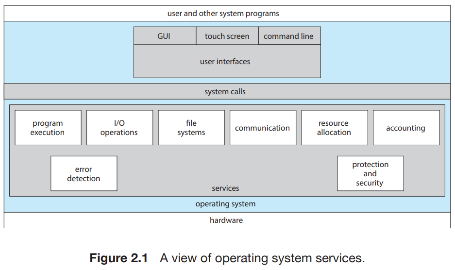

1. **User interface**
    
    = 거의 모든 운영체제는 사용자 인터페이스(UI)를 제공한다.
    
    *ex) Graphic User Interface(GUI), TouchScreen Interface, Command Line Interface*
    
2. **Program execution**
    
    = 시스템은 프로그램을 메모리에 적재해 실행할 수 있어야 한다.
    
3. **I/O operation**
    
    = 수행 중인 프로그램은 입출력을 요구할 수 있다. 이러한 입출력에는 파일 혹은, 입출력 장치가 연관될 수 있다.
    
4. **File-system manipulation**
    
    = 프로그램은 파일을 읽고 쓸 필요가 있고, 이름에 의해 파일을 생성하고 삭제할 수 있고 지정된 파일을 찾을 수 있어야 하고 파일의 정보를 열거할 수 있어야 한다.
    
5. **Communications**
    
    = 프로세스 사이에 정보 교환(IPC)을 지원해 준다.
    
    … *Shared Memory, Message-Passing*
    
6. **Resource allocation**
    
    = 다수의 프로세스나 다수의 작업이 동시에 실행될때, 그들 각각에 자원을 할당해 주어야 한다.
    
7. **Logging**
    
    = 어떤 프로그램이 어떤 종류의 컴퓨터 자원을 얼마나 많이 사용하는지에 대해서 기록 작성
    
8. **Protection and security**
    1. Protection = 시스템 자원에 대한 모든 접근이 통제되도록 보장
    2. Security = 네트워크 어댑터 등과 같은 외부 입출력 장치들을 부적합한 접근 시도로부터 지키고, 침입의 탐지를 위해 모든 접속을 기록

---

## User and Operating-System Interface

✅ **Key point !** **CLI, GUI, Touch-Screen Interface**

> 3 ways for users to interface with the OS
> 
> - CLI
> - GUI
> - Touch-Screen Interface

(1) **CLI (Command Line Interface, or Command Interprete)**

= Linux, UNIX 및 Windows를 포함한 운영체제 대부분은 프로세스가 시작되거나 사용자가 (대화형 시스템상에서) 처음 로그온 할 때 명령 인터프리터를 특수한 프로그램으로 취급한다.

┕ 선택할 수 있는 여러 명령 인터프리터를 제공하는 시스템에서 이 해석기 ⇒ ***Shell***

> 명령 인터프리터의 중요한 기능은 사용자가 지정한 명령을 가져와서 그것을 수행하는 것이다. 아래는 명령어들이 구현될 수 있는 일반적인 2가지 방식이다.
> 
> 
> 
> 1. 명령 인터프리터 자체가 명령을 실행할 코드를 가지는 경우
> 2. 시스템 프로그램에 의해 대부분의 명령을 구현하는 경우

(2) **GUI (Graphical User Interface)**

= CLI를 통하여 사용자가 직접 명령어를 입력하는 것이 아니라 **데스크톱이라고 특정지어지는 마우스를 기반으로 하는 윈도 메뉴 시스템을 사용한다.**

(3) **Touch-Screen Interface**

= 스마트폰 및 휴대용 태블릿 컴퓨터는 일반적으로 터치스크린 인터페이스

- 컴퓨터를 관리하는 시스템 관리자와 시스템에 대해 깊게 알고 있는 파워 유저들은 **명령어 라인 인터페이스(CLI)**를 사용한다.
    
    ┕ 몇몇 시스템에서는 GUI를 통해서는 시스템 기능의 일부만을 이용할 수 있고 자주 쓰이지 않는 나머지 기능은 CLI를 사용할 수 있는 사용자만이 이용할 수 있다.
    

🤔 **셸 스크립트(shell scripts) =** 셸이나 Command Line 인터프리터에서 돌아가도록 작성되었거나 한 운영 체제를 위해 쓰인 스크립트

┕ 일반 기능 : 파일 이용, 프로그램 실행, 문자열 출력 등

---

## System Calls

✅ **Key point !** **System Calls**

🤔 **System Calls** = OS에 의해 사용가능한 서비스에 대한 인터페이스를 제공한다.

- **API** (Application Programming Interface)
    
    = 각 함수에 전달되어야 할 매개변수들과 프로그래머가 기대할 수 있는 반환 값을 포함하여 Application 프로그래머가 사용 가능한 함수의 집합을 명시한다.
    
    - common API : Windows API, POSIX API, Java API
    
    ┕ API를 구성하는 함수들은 통상 Application Programmer를 대신하여 실제 시스템 콜을 호출한다.
     *ex) Windows 함수 CreateProcess() API는 실제로 Windows 커널의 NTCreateProcess() 시스템 콜을 부른다.*
    
- **RTE** (Run Time Environment)
    
    = OS 가 제공하는 시스템 콜에 대한 연결고리 역할을 하는 시스템 콜 인터페이스를 제공한다.
    
    ┕ API 함수의 호출을 intercept해서 필요한 운영체제 시스템 콜을 부른다.
    

<aside>
💡 통상 각 시스템 콜에는 번호가 할당되고 시스템 콜 인터페이스는 이 번호에 따라 색인되는 테이블을 유지한다. 시스템 콜 인터페이스는 의도하는 시스템 콜을 부르고 시스템 콜의 상태와 반환 값을 돌려준다.

</aside>

<aside>
💡 운영체제 인터페이스에 대한 대부분의 자세한 내용은 API에 의해 프로그래머로부터 숨겨지고 RTE에 의해 관리된다.

</aside>

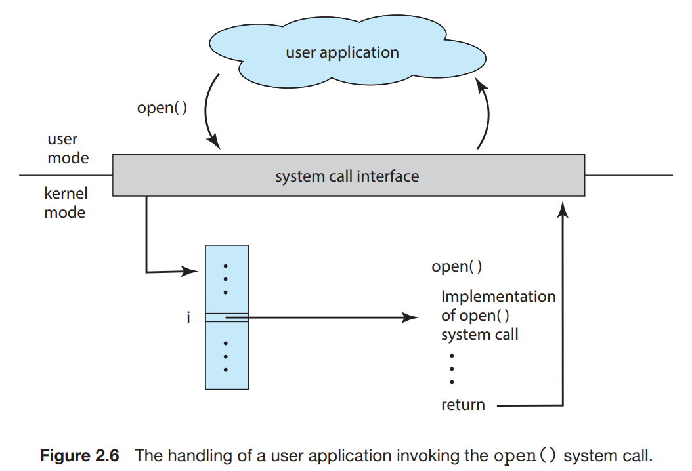

> 시스템 콜 호출을 위해서는 운영체제에 매개변수를 전달해야만 한다. 이를 위해서 보통 운영체제는 3개의 일반적인 방법을 사용한다.
> 
> 1. 매개변수를 레지스터 내에 전달하는 방법
> 2. 매개변수를 메모리 내의 블록이나 테이블에 저장하고, 블록의 주소가 레지스터 내에 매개변수로 전달되는 방법
> 3. 매개변수를 메모리 내의 스택에 push & pop 하는 방법

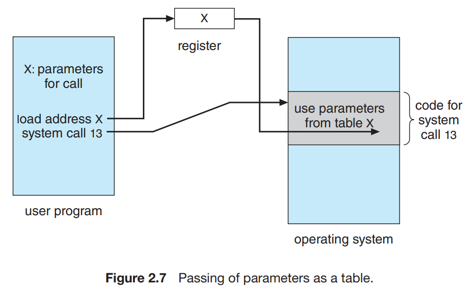

┕ 시스템 콜 유형 5가지

(1) **프로세스 제어 (Prcess Control)**

- 프로세스에 실행 중인 프로그램은 수행을 정상적으로(end()) 또는 비정상적으로(abort()) 멈출 수 있어야 한다.
- 한 프로그램을 실행하고 있는 프로세스가 다른 프로그램을 적재(load())하고 실행(execute()) 할 수 있어야 한다.
- 운영체제는 프로세스의 속성들을 결정하고 재설정(reset)할 수 있는 능력이 있어야 한다.
- 특정 이벤트가 일어날 때까지 프로세스를 기다려야 할 수도 있다.
- 프로세스 간에 공유되는 일관성을 보장하기 위해서 운영체제는 종종 프로세스가 공유 데이터를 잠글(lock) 수 있는 시스템 콜을 제공한다.

(2) **파일 관리 (File Management)**

- 파일을 생성(create())하고 삭제(delete())할 수 있어야 한다.
- 파일을 열고(open())고 읽고(read()), 쓰고(write()), 위치 변경(reposition()), 되감기(rewind()), 파일 닫기(close())를 할 수 있어야 한다.
- 파일에 대한 속성을 얻을(get_file_attribute()) 수 있어야 하고 파일 속성을 설정(set_file_attribute())할 수 있어야 한다.

(3) **장치 관리 (Device Management)**

- 다수의 사용자가 동시에 사용하는 시스템은 독점적인 장치 사용을 보장받기 위해 우선 그 장치를 요청(request())할 수 있어야 하고 그 장치의 사용이 끝나면 우리는 방출(release())할 수 있어야 한다.
- 장치를 읽고(read()), 쓰고(write()), 위치 변경(reposition())할 수 있어야 한다.
- 장치의 속성을 얻을 수 있어야 하고, 설정할 수 있어야 한다.
- 논리적으로 장치를 붙이고 제거할 수 있어야 한다.

(4) **정보 유지 관리 (Information Maintenance)**

- 현재 시간(time())과 날짜 정보를(date()) 제공할 수 있어야 하고 설정할 수 있어야 한다.
- 프로그램이 특정 위치, 혹은 위치의 집합에서 수행한 시간의 양을 나타내는 시간 프로파일(time profile)을 제공한다.
- 프로세스, 파일, 장치에 대한 속성을 얻을 수 있고 설정할 수 있어야 한다.
- 시스템 데이터를 얻을 수 있어야 하고, 설정할 수 있어야 한다.

(5) **통신 (Communications)**

- 메시지 전달을 위해 communication connection을 생성할 수 있어야하고 삭제할 수 있어야 한다.
- 메시지를 받을 수 있어야 하고 보낼 수 있어야 한다.
- 상태 정보를 전송할 수 잇어야 한다.
- 원격 장치를 붙이고 땔 수 있어야 한다.

(6) **보호 (Protection)**

- 자원 접근 허가를 얻을 수 있어야 하고 설정할 수 있어야 한다.

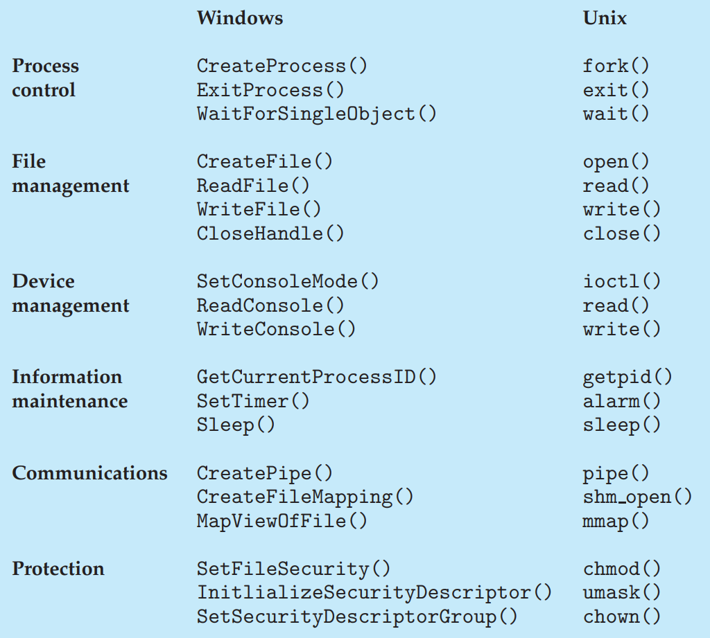

Windows와 UNIX 시스템 콜의 예

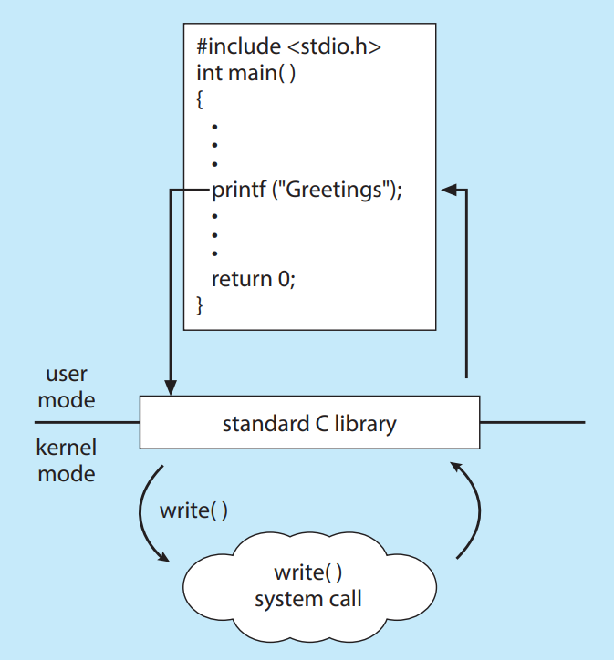

표준 C 라이브러리 

---

## **System Services**

✅ **Key point !** **System Calls**

🤔 **System Service** = **시스템 유틸리티(system utility)**로도 알려진, 프로그램 개발과 실행을 위해 더 편리한 환경을 제공한다.

> 분류별 서비스
> 
> - **파일 관리**
>     
>     : 파일과 디렉터리를 생성, 삭제, 복사, rename, 인쇄, 열거할 수 있는 서비스
>     
> - **상태 정보**
>     
>     : 시스템의 날짜, 시간, 사용 가능한 메모리와 디스크 공간의 양, 사용자 수, 로깅 및 디버깅 정보 등의 상태 정보를 제공하는 서비스
>     
> - **파일 변경**
>     
>     : 파일의 내용을 생성하고 변경하기 위한 서비스
>     
> - **프로그래밍 언어 지원**
>     
>     : 일반적인 프로그래밍 언어들에 대한 컴파일러, 어셈블러, 디버거 및 인터프리터가 운영체제와 함께 제공되는 서비스
>     
> - **프로그램 적재와 수행**
>     
>     **:** 프로그램이 어셈블되거나 컴파일된 후, 그것이 수행하기 앞서 메모리에 적재시키는 서비스
>     
> - **통신**
>     
>     : 프로세스, 사용자, 다른 컴퓨터 시스템들 사이에 가상 접속을 이루기 위한 기법을 제공하는 서비스
>     
> - **백그라운드 서비스**
>     
>     : 네트워크 디먼, 프로세스 스케줄러 등과 같은 백그라운드 서비스
>     

<aside>
💡 *사용자 대부분이 보는 운영체제의 관점은 실제의 시스템 콜에 의해서보다는 시스템 프로그램과 Application에 의해 정의된다.*

</aside>

---

## **Linkers and Loaders**

✅ **Key point ! Linkers**

\- 일반적으로 프로그램은 디스크에 이진 실행 파일(ex. a.out 또는 prog.exe)로 존재한다.

\- CPU에서 실행하려면 프로그램을 메모리로 가져와 프로세스 형태로 배치되어야 한다.

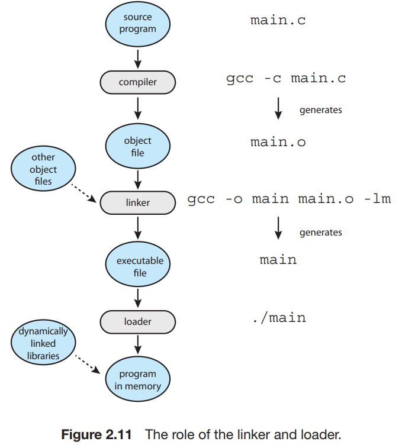

1. 소스 파일은 임의의 물리 메모리 위치에 적재되도록 설계된 오브젝트 파일로 컴파일 된다. 이러한 형식을 **재배치 가능 오브젝트 파일**이라고 한다.
2. 다음으로 **링커**는 이러한 재배치 가능 오브젝트 파일을 하나의 **이진 실행 파일**로 결합한다. (다른 오브젝트 파일 또는 라이브러리도 포함될 수 있다.)
3. **로더**는 이진 실행 파일을 **메모리에 적재하는데 사용**되며, **실행 파일이 CPU 코어에서 실행할 수 있는 상태가 된다.**

\- 링크 및 로드와 관련된 활동은 재배치로, 프로그램 부분에 최종 주소를 할당하고 프로그램 코드와 데이터를 해당 주소와 일치하도록 조정하여 프로그램이 실행될 때 코드가 라이브러리 함수를 호출하고 변수에 접근할 수 있게 한다.

\- 실제 시스템 대부분에서는 프로그램이 적재될 때 라이브러리를 동적으로 링크할 수 있는 기능을 지원한다.
 *ex) The dynamic linked library(DLL) of Windows*

*\*- 링커는 프로그램이 적재될 때 동적으로 링크되고 적재될 수 있도록 재배치 정보를 삽입하기 때문에 여러 프로세스가 동적으로 링크된 라이브러리를 공유할 수 있어 메모리 사용이 크게 절약될 수 있다.

---

## **Why Applications Are Operating-System Specific**

✅ **Key point ! Application이 여러 OS에서 실행될 수 있게 만드는 방법 3가지**

<aside>
💡 기본적으로 한 OS 에서 컴파일된 응용 프로그램은 다른 운영체제에서 실행할 수 없다.

</aside>

> Application이 여러 OS에서 실행될 수 있게 만드는 방법 3가지
> 
> 1. OS마다 인터프리터가 제공되는 인터프리터 언어로 Application을 만드는 방법 *ex) Python, Ruby*
> 2. 실행 중인 Application을 포함하고 있는 가상 머신을 가진 언어로 Application을 만드는 방법 *ex)  JAVA*
> 3. 컴파일러가 기기 및 OS 고유의 이진 파일을 생성하는 표준 언어 또는 API를 사용하는 방법 *ex) POSIX API*

---

## O**perating System Design and Implementation**

✅ **Key point ! 기법, 정책**

- 설계 목표
    - **시스템을 설계하는 데에 첫째 문제점은 시스템의 목표와 명세를 정의하는 일이다.** 시스템 설계는 최상위 수준에서는 하드웨어와 시스템 유형의 선택에 의해 영향을 받을 것이다.
    - 최상위 설계 수준을 넘어서면 요구 조건들을 **사용자 목적**과 **시스템 목적**의 두 그룹으로 나눌 수 있다.
    - OS의 명세와 설계는 매우 창조적인 일이며, 어떤 책에서도 이런 문제점을 해결하는 방법을 알려줄 수는 없지만, 특별히 OS에 적용 가능한 일반적인 원칙들은 존재한다.

- 기법과 정책

<aside>
💡 한 가지 중요한 원칙은 ***기법(Mechanism)**으로부터 **정책(Policy)**를 분리하는 것*이다.

</aside>

🤔 **기법** = 어떤 일을 어떻게 할 것인가를 결정하는 것

🤔 **정책** = 무엇을 할 것인가를 결정하는 것

- 구현
    - 초기 운영체제는 어셈블리 언어로 작성되었다. 이제 대부분은 C 또는 C++와 같은 고급 언어로 작성되며, 극히 일부의 시스템이 어셈블리 언어로 작성된다.
    - 운영체제의 주요 성능 향상은 운영체제를 구현하는 고급 언어의 유/무 보다는 좋은 자료구조와 알고리즘의 결과일 가능성이 크다.

---

## **Operating System Structures**

✅ **Key point ! OS Structures**

> OS Structures
> 
> 1. 모놀리식 구조
> 2. 계층적 접근
> 3. 마이크로커널
> 4. 모듈
> 5. 하이브리드 시스템

1. 모놀리식 구조

🤔 **모놀리식 구조** = 커널의 모든 기능을 단일 주소 공간에서 실행되는 단일 정적 이진 파일에 넣는 것

┕ 제한적인 구조를 가진 운영체제의 예는 최초의 UNIX 운영체제로 커널과 시스템 프로그램의 두 부분으로 구성된다.

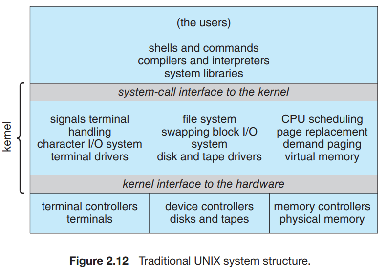

전통적인 UNIX 시스템 구조 : 시스템 콜 인터페이스 아래와 물리적 HW 위의 모든 것이 커널이다.

\- Linux OS : UNIX에 기반을 두고 있으며 위의 그림과 유사하게 구성된다.

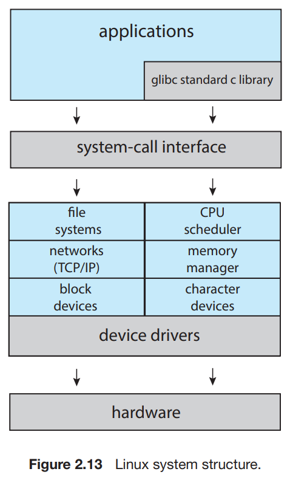

Linux 시스템 구조

┕ 장점 : 모놀리식 커널은 성능 면에서 뚜렷한 이점이 있다. 시스템 콜 인터페이스에는 오버헤드가 거의 없고 커널 안에서의 통신 속도가 빠르다.

┕ 단점 : 모놀리식 커널의 명백한 단순성에도 불구하고 이 구조는 구현 및 확장하기 어렵다. 

⇒ 따라서 모놀리식 커널의 단점에도 불구하고, 속도와 효율성은 이 구조의 증거를 여전히 UNIX, Linux 및 Windows 운영체제에서 발견할 수 있는 이유이다.

1. 계층적 접근

🤔 **계층적 접근** = OS가 여러 개의 층으로 나뉘는데, 최하위 층은 HW이고, 최상위 층은 사용자 인터페이스 이다.

┕ 장점 : 구현과 디버깅이 간담함

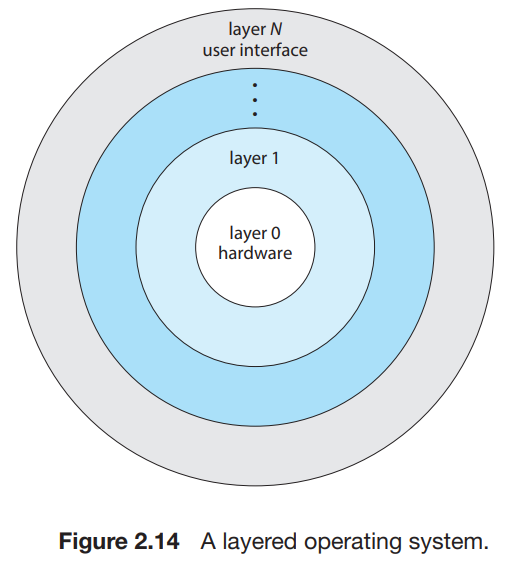

OS층은 데이터와 이를 조작하는 연산으로 구성된 추상된 객체의 구현이다.

┕ 계층화된 시스템은 컴퓨터 네트워크(TCP/IP) 및 웹 응용 프로그램에서 성공적으로 사용됐다.

1. 마이크로커널

🤔 **마이크로커널** = 모든 중요치 않은 구성요소를 커널로부터 제거하고, 그들을 별도의 주소 공간에 존재하는 사용자 수준 프로그램으로 구현하여 OS를 구성하는 방법

*ex) Mach OS*

┕ 마이크로커널의 주 기능은 클라이언트 프로그램과 사용자 공간에서 수행되는 다양한 서비스 간에 통신을 제공하는 것이다. 통신은 메시지 전달에 의해 제공된다.

┕ 장점 : OS의 확장이 쉽다.

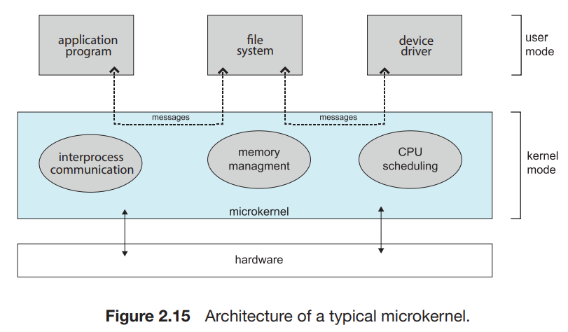

┕ 모든 새로운 서비스는 사용자 공간에 추가되며, 따라서 커널을 변경할 필요가 없다. 커널이 변경되어야만 할 때는, *마이크로커널이 작은 커널이기 떄문에 변경할 대상이 비교적 적은 경향이 있다.*

┕ 서비스 대부분이 커널이 아니라 **사용자 프로세스로 수행**
되기 떄문에 또한 더욱 높은 보안성과 신뢰성을 제공한다.

┕ 가중된 시스템 기능 오버헤드 때문에 성능이 나쁘다.

1. 모듈

🤔 **LKM** (Loadable Kernel Modules) = 커널은 핵심적인 구성요소의 집합을 가지고 있고 부팅 때 또는 실행 중에 부가적인 서비스들을 모듈을 통하여 링크할 수 있다.

*ex) Linux, Mac OS X, Solaris 등*

┕ 설계의 주안점은 *커널은 핵심 서비스를 제공하고 다른 서비스들은 커널이 실행되는 동안 동적으로 구현*하는 것이다.

┕ 전체적인 결과는 커널의 각 부분이 정의되고 보호된 인터페이스를 가진다는 점에서 계층 구조를 닮았지만 모듈에서 임의의 다른 모듈을 호출할 수 있다는 점에서 계층 구조보다 유연하다.

┕ 중심 모듈은 단지 핵심 기능만을 가지고 있고 다른 모듈의 적재 방법과 모듈들과 어떻게 통신하는지 안다는 점에서는 마이크로 커널과도 유사하다.

┕ 통신하기 위하여 메시지 전달을 호출할 필요가 없기 때문에 더 효율적이다.

1. 하이브리드 시스템

(1) **MacOS and iOS**

- Apple의 macOS 운영체제는 *주로 데스크톱 및 랩톱 컴퓨터 시스템에서 실행되도록 설계*되었으며 iOS는 iPhone 스마트폰 및 iPad 태블릿 컴퓨터용으로 설계된 모바일 운영체제이다.
- **Darwin**이라고 불리는 하이브리드 커널 환경을 사용한다.
    - Darwin은 주로 Mach 마이크로커널과 BSD UNIX 커널로 구성된 계층화된 시스템이다.
    - Darwin 구조 그림은 아래에 명시되어 있다.
    - Mach는 메모리 관리, CPU 스케줄링 및 메시지 전달 및 원격 프로시저 호출과 같은 프로세스간 통신 기능을 포함한 기본 운영체제 서비스를 제공한다. (커널 추상화를 통해 사용 가능)
    - 마이크로커널의 성능 문제를 해결하기 위해 Darwin은 Mach, BSD, I/O 키트 및 모든 커널 확장을 단일 주소 공간으로 결합한다.
    
    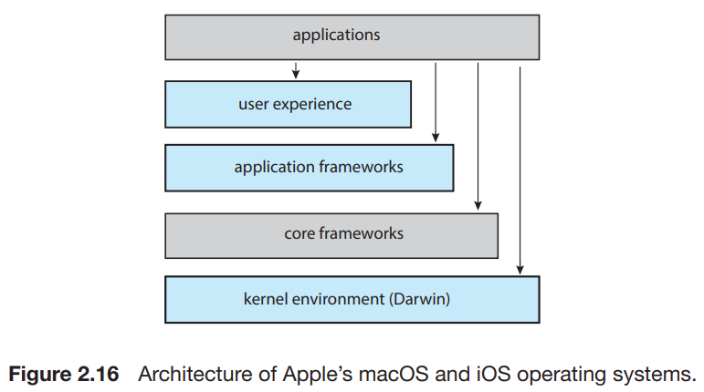
    
    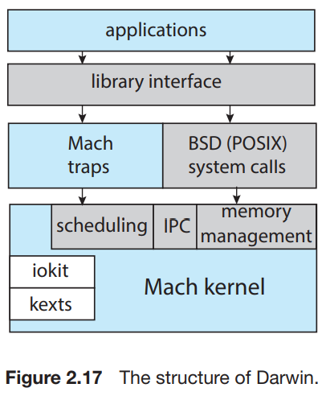
    

(2) **Android**

- Android 운영체제는 *Open Handset Alliance가 설계*하였으며 Android 스마트폰과 태블릿을 위해 개발되었다.
- Android 장치의 소프트웨어 설계자는 Java 언어로 응용 프로그램을 개발하지만 일반적으로 표준 Java API를 사용하지 않고 별도의 Android API를 사용한다.
- Java 응용 프로그램은 Android RunTime(ART)에서 실행할 수 있는 형식으로 컴파일된다.
    - ART는 Android용으로 설계되어 메모리와 CPU 처리 능력이 제한적인 모바일 장치에 최적화된 가상 머신이다.
- Android 개발자는 개발자가 가상 머신을 우회할 수 있게 하는 Java 네이티브 인터페이스를 사용하여 Java 프로그램을 작성하여 특정 하드웨어 기능에 액세스 할 수 있는 프로그램을 작성할 수 있다.
- 하드웨어 추상화 계층 또는 HAL을 통해 물리적 하드웨어를 추상화한다.
- Android 소프트웨어 스택의 맨 아래에는 Linux 커널이 있다.

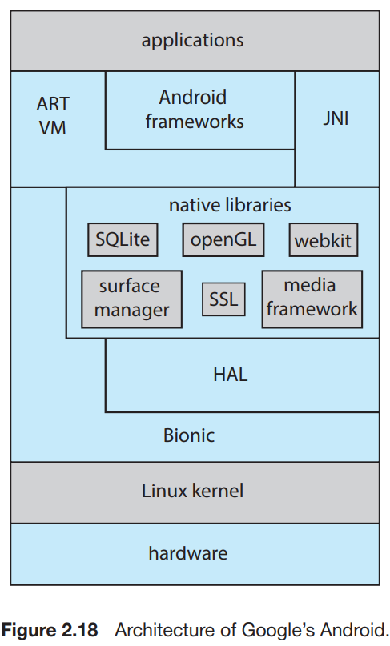

---

## **Building and Booting an Operating System**

✅ **Key point ! System booting**

(1) OS 생성

> **운영체제를 처음부터 생성(또는 빌딩)하는 경우 절차**
> 
> 1. 운영체제 소스 코드를 작성한다(또는 이전에 작성된 소스 코드를 확보한다.)
> 2. 실행될 시스템을 위해 운영체제를 구성한다.
> 3. 운영체제를 컴파일 한다.
> 4. 운영체제를 설치한다.
> 5. 컴퓨터와 새 운영체제를 부팅한다.

- 시스템을 구성하려면 어떤 기능이 포함되는지 명시해야 하며 이는 운영체제에 따라 다르다.
    - 일반적으로 시스템 구성 방법을 설명하는 매개변수는 특정 유형의 구성 파일에 저장되며 이 파일을 만든 후에는 여러가지 방법으로 사용할 수 있다.
    
- 상세한 조정을 할 수 없는 수준에서는 시스템 설명을 통하여 기존 라이브러리에서 사전 컴파일된 오브젝트 모듈을 선택할 수 있다.
    - *이 모듈들이 서로 링크되어 새 운영체제가 생성된다.*
    
- 다른 경우에는 완전히 모듈 방식으로 시스템을 구성할 수 있다.
    - 여기서 선택은 컴파일 또는 링크 시간이 아닌 *실행 시간(Runtime)*에 일어난다.
    - 시스템 생성은 단순히 시스템 구성을 설명하는 매개변수의 설정만 하면 된다.

(2) 시스템 부트

🤔 시스템 부팅 (**Booting)** = 커널을 적재하여 컴퓨터를 시작하는 과정

> **대부분 시스템의 부팅 과정**
> 
> 1. **부트스트랩 프로그램(Bootstrap Program)** or **부트 로더(Boot Loader)**라고 불리는 작은 코드가 커널의 위치를 찾는다.
> 2. 커널이 메모리에 적재되고 시작된다.
> 3. 커널은 하드웨어를 초기화 한다.
> 4. 루트 파일 시스템이 마운트 된다.

- 많은 최신 컴퓨터 시스템이 BIOS 기반 부팅 과정을 **UEFI(Unified Extensible Firmware Interface)**로 대체하였다.
    
    ┕ 장점 : UEFI가 하나의 완전한 부팅 관리자이므로 다단계 BIOS 부팅 과정보다 빠르다.
    
- **부트스트랩 프로그램**은 커널 프로그램이 포함된 파일을 메모리에 적재하는 것외에도 진단을 실시하여 메모리와 CPU를 점검하고 장치 검색과 같은 시스템 상태를 확인한다.
    - 진단을 통과하면 프로그램은 부팅 과정을 계속 진행할 수 있다.
    - CPU 레지스터에서 장치 컨트롤러 및 메인 메모리의 내용에 이르기까지 시스템의 모든 측면을 초기화 할 수 있다.
    - 조만간 운영체제를 시작하고 루트 파일 시스템을 마운트 한다. 바로 이 시점에서 **시스템이 실행 중**이라고 할 수 있다.
    
- **GRUB**는 Linux 및 UNIX 시스템을 위한 **공개 소스 부트스트랩 프로그램**이다.
    - 시스템의 부트 매개변수는 GRUB 구성 파일에 설정되며 GRUB의 실행 시작 시점에 적재된다.
    
- 부팅 과정에서 **부트 로더**는 일반적으로 **initramfs로 알려진 임시 RAM 파일 시스템을 생성**한다.
    - 이 파일 시스템에는 실제 루트 파일 시스템을 지원하기 위해 설치해야하는 드라이버와 커널 모듈이 저장되어 있다.
    - **커널이 시작되고 필요한 드라이버가 설치되면 커널은 루트 파일 시스템을 임시 RAM 위치(initramfs)에서 적절한 루트 파일 시스템 위치로 전환**한다.
    - 마지막으로 Linux는 시스템의 초기 프로세스인 **systemd**
     프로세스를 생성한 다음 다른 서비스를 시작한다.
        
        (UNIX는 init 프로세스)
        
    
- Windows, Linux, macOS, iOS 및 Android를 비롯한 대부분의 운영체제의 **부트 로더**는 하드웨어 문제 진단, 손상된 파일 시스템 복구 및 운영체제 재설치 등의 작업을 할 수 있는 **복구 모드**
 또는 **단일 사용자 모드**로 부팅할 수 있는 기능을 제공한다.

---

## **Operating System Debugging**

✅ **Key point ! Debugging, BCC**

🤔 **디버깅** (Debugging) = HW와 SW에서의 시스템의 오류를 발견하고 수정하는 행위

- 장애 분석
    
    : 만일 프로세스가 실패한다면 → OS 대부분은 시스템 관리자 또는 문제를 발생시킨 사용자에게 문제가 발생했다는 것을 경고하기 위해 → 오류 정보를 **로그 파일**에 기록
    
    - OS는 프로세스가 사용하던 메모리를 캡처한 **코어 덤프(core dump)**를 취하고 차후 분석을 위해 파일로 저장한다.
    - **크래시** = 커널 장애
        
        ┕ 커널 장애는 오류 정보가 로그 파일에 저장되고 메모리의 상태가 **크래시 덤프(crash dump)**에 저장된다.
        
    
- 성능 관찰 및 조정
    - 시스템은 동작을 측정하고 표시할 수 있는 방법을 가지고 있어야 한다.
    - 도구는 프로세스별 or 시스템 전체의 관찰을 제공하느냐로 특징이 묘사될 수 있다.
    - 이러한 관찰을 위해 도구는 “카운터” or “추적” 의 2가지 접근 방식 중 하나를 사용할 수 있다.
        - 카운터
        
        : OS는 일련의 카운터를 통해 호출된 시스템 콜 횟수 또는 네트워크 장치 또는 디스크에 수행된 작업 수와 같은 ***시스템 활동을 추적***한다.
        
        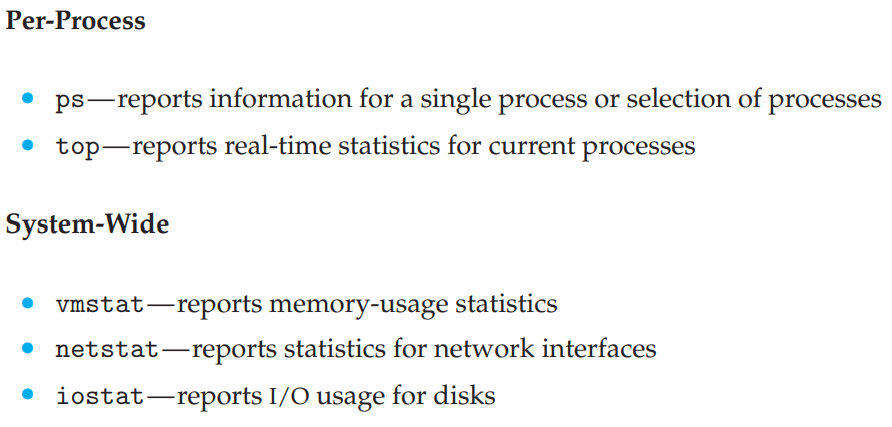
        

- 추적 (Tracing)
    - **추적 도구** (Tracing Tool) = 시스템 콜과 관련된 단계와 같은 특정 이벤트에 대한 데이터를 수집한다.
    
    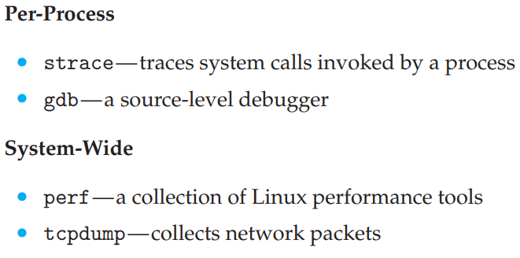
    

- **BCC**
    
    =  Linux 시스템을 위한 추적 기능을 제공하는 풍부한 툴킷
    
    - eBPF 도구에 대한 프론트-엔드 인터페이스
    - BPF 기술은 컴퓨터 네트워크에서 트래픽을 필터링하기 위해 1990년대 초에 개발되었다.
    - eBPF 명령어는 특정 이벤트를 캡처하거나 시스템 성능을 관찰하는데 사용될 수 있다. 하지만  Linux 커널에 삽입하기 전에 **검증기**를 통과해야한다.
    - BCC는 eBPF를 사용하는 도구를 더 쉽게 작성할 수 있도록 개발되었으며 Python 언어로 작성된 프론트-엔드 인터페이스를 제공한다.
    - BCC도구는 Python으로 작성되며 eBPF 계측 기능과 인터페이스 하는 C 코드를 내장한다.
        - 이 계측 기능은 이어서 커널과 인터페이스 한다.
    - BCC도구는 또한 C 프로그램을 eBPF 명령어로 컴파일하고, probe 또는 tracepoint를 사용하여 커널에 삽입한다.
        - Probe와 tracepoint는 Linux 커널에서 이벤트 추적을 허용하는 두가지 기술이다.
    - BCC가 제공하는 많은 도구는 MySQL 데이터베이스, Java 및 Python 프로그램과 같은 특정 응용 프로그램에 사용할 수 있다.
    - BCC를 특히 강력하게 만드는 것은 시스템에 해를 끼치지 않고 *중요한 응용 프로그램을 실행하는 실제 프로덕션 시스템에서 해당 도구를 사용할 수 있다는 것*이다.