# Chap3 Process

## 3.1 프로세스 개념

- 작업을 실행하는 일괄처리 시스템
- 사용자 프로그램 또는 태스크를 실행하는 시분할 시스템

- 현대적인 용어인 프로세스, 하지만 운영체제의 주요 활동이 작업 처리인 시절에 많은 운영체제 이론 및 용어가 개발되었기 때문에 작업이라는 용어는 역사적으로 중요한 의미가 있다.
    
    ⇒ 따라서 일부 적절한 경우 운영체제의 역할을 설명할 때 **작업**을 사용한다.
    

### **3.1.1 프로세스 개념**

- 비공식적으로, 프로세스는 실행 중인 프로그램을 말한다.
    - 현재 활동 상태는 **프로그램 카운터(PC) 값**과 **프로세서 레지스터의 내용**으로 나타낸다.
    - 프로세스의 메모리 배치는 일반적으로  아래의 그림과 같이 여러 섹션으로 구분된다.

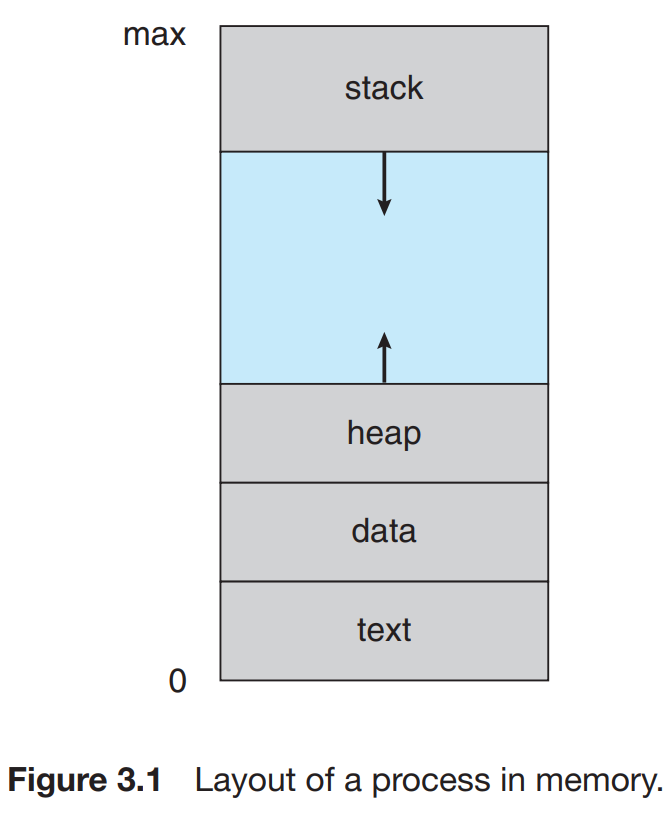

- 섹션 구분
    - **텍스트 섹션** = 실행 코드
    - **데이터 섹션** = 전역 변수
    - **힙 섹션** = 프로그램 실행 중에 동적으로 할당되는 메모리
    - **스택 섹션** = 함수를 호출할 때 임시 데이터 저장소
        
        *ex) 함수 매개변수, 복귀 주소 및 지역 변수*
        
    
- 스택 및 힙 섹션은 런타임에 서로의 방향으로 더 커지더라도 운영체제는 서로 겹치지 않도록 해야 한다.

- 프로그램은 명령어 리스트를 내용으로 가진 디스크에 저장된 파일(= 실행파일) 과 같은 수동적인 존재이다.
    - 이와는 대조적으로 프로세스는 다음에 실행할 명령어를 지정하는 프로그램 카운터와 관련 자원의 집합을 가진 능동적인 존재이다.
    - 실행 파일이 메모리에 적재될 때 프로그램은 프로세스가 된다.

- 실행파일을 메모리에 적재하는 일반적인 2가지 방식
    1. 실행 파일을 나타내는 아이콘을 더블 클릭하는 방식
    2. 명령어 라인상에서 `prog.exe` 또는 `a.out` 과 같은 파일 이름을 입력하는 방식  

- 프로세스 자체가 다른 개체를 위한 실행 환경으로 동작할 수 있다는 사실에 주목하자 
*ex) JVM; Java 프로그래밍 환경*
    - **JVM**은 적재된 Java 코드를 해석하고 그 코드를 대신하여 원 기계어를 이용하여 행동을 취하는 프로세스로서 프로그램을 실행한다.
    - Java 명령어는 JVM을 보통의 프로세스처럼 실행시키고, JVM은 Java 프로그램 가상기계 안에 실행한다.

### 3.1.2 프로세스 상태

- 프로세스는 실행되면서 그 상태가 변한다.
    - 프로세스의 상태는 부분적으로 그 프로세스의 현재 활동에 따라서 정의된다.

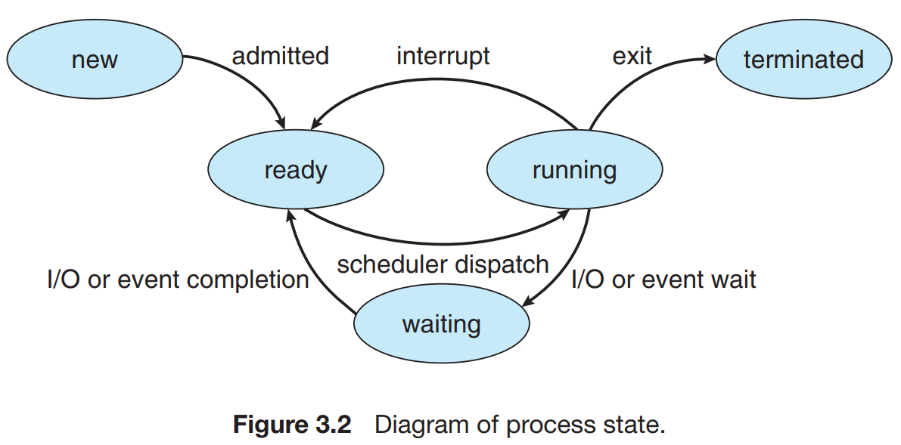

- 프로세스 상태
    - **new** = 프로세스가 생성 중이다.
    - **running** = 명령어들이 실행되고 있다.
    - **waiting** = 프로세스가 어떤 이벤트 (I/O 완료 or 신호의 수신 같은) 가 일어나기를 기다린다.
    - **ready** = 프로세스가 processor에 할당되기를 기다린다.
    - **terminated** = 프로세스의 실행이 종료되었다.

- 어느 한순간에 한 processor 의 코어에서는 오직 하나의 프로세스만이 실행된다는 것을 인식하는 것이 중요하다.
    - 그렇지만, 많은 프로세스가 ready or waiting 상태에 있을 수 있다.
    

### 3.1.3 프로세스 제어 블록

- 각 프로세스는 운영체제에서 **프로세스 제어 블록**(**PCB**, Process Control Block) (= 태스크 제어 블록) 에 희해 표현된다.

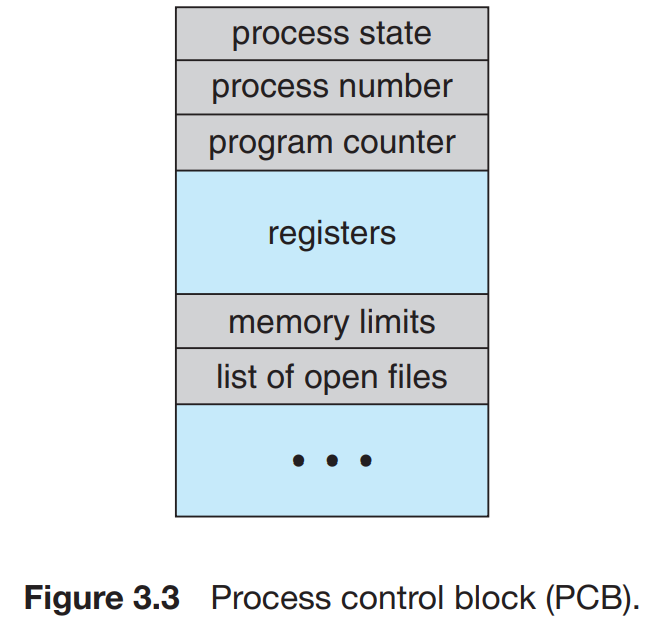

- PCB는 특정 프로세스와 연관된 여러 정보를 수록하며, 다음과 같은 것들을 포함한다.
    - 프로세스 상태
        
        : 상태는 new, ready, runnig, waiting, halted 등이다.
        
    - 프로그램 카운터
        
        : 프로세스가 다음에 실행할 명령어의 주소를 가리킨다.
        
    - CPU 레지스터들
        
        : 컴퓨터 구조에 따라 다양한 수와 유형을 갖는다.
        
        : 레지스터에는 누산기, 인덱스/스택/범용 레지스터들과 상태코드 정보가 포함된다.
        
        : 프로그램 카운터와 함께 이 상태 정보는 나중에 프로세스가 다시 스케줄 될 때 계속 올바르게 실행되도록 하기 위해서 인터럽트 발생 시 저장되어야 한다.
        
    - CPU - 스케줄링 정보
        
        : 프로세스 우선순위, 스케줄 큐에 대한 포인터와 다른 스케줄 매개변수를 포함한다.
        
    - 메모리 관리 정보
        
        : 운영체제에 의해 사용되는 메모리 시스템에 따라 기준 (base) 레지스터와 한계 (limit) 레지스터의 값, 운영체제가 사용하는 메모리 시스템에 따라 페이지 테이블 or 세그먼트 테이블 등과 같은 정보를 포함한다.
        
    - 회계 (accounting) 정보
        
        : CPU 사용 시간과 경과된 실시간, 시간 제한, 계정 번호, Job(잡) or 프로세스 번호 등을 포함한다.
        
    - I/O 상태 정보
        
        : 프로세스에 할당된 I/O 장치들과 열린 파일의 목록 등을 포함한다.
        
    
    요약하면 
    ⇒ *프로세스 제어 블록(PCB)은 약간의 회계 데이터와 함께 프로세스를 시작시키거나 다시 시작시키는 데 필요한 모든 데이터를 위한 저장소의 역할을 한다.*
    

## 3.1.4 스레드

- 프로세스의 개념을 확장하여 한 프로세스가 다수의 실행 스레드를 가질 수 있도록 허용한다. 따라서 현대 운영체제는 프로세스가 한번에 하나 이상의 일을 수행할 수 있도록 허용한다.

> 스레드 활용 예시
> 
> 
> *ex) 다중 스레드 워드 프로세스는 하나의 스레드에 사용자 입력 관리를 맡기는 동안 다른 스레드가 철자 검사기를 수행하도록 만들 수 있다.*
> 

## 3.2 프로세스 스케줄링

- (= CPU 스케줄링)
- 다중 프로그래밍의 목적 : CPU 이용을 최대화하기 위해 항상 어떤 프로세스가 실행되도록 한다.
- 시분할의 목적 : 각 프로그램이 실행되는 동안 사용자가 상호 작용할 수 있도록 프로세스들 사이에서 CPU 코어를 빈번하게 교체하는 것이다.

- 위 목적들을 달성하기 위해 **프로세스 스케줄러**는 코어에서 실행 가능한 여러 프로세스 중에서 하나의 프로세스를 선택한다.
    - 다중 코어 시스템은 한 번에 여러 프로세스를 실행할 수 있다.
    - 코어보다 많은 프로세스가 있는 경우, 초과 프로세스는 코어가 사용 가능해지고 다시 스케줄 될 때까지 기다려야 한다.
    - 현재 메모리에 있는 프로세스 수를 **다중 프로그래밍 정도** 라고 한다.

- 다중 프로그래밍 및 시간 공유의 목표를 균형있게 유지하려면 프로세스의 알반적인 동작을 고려해야 한다.
    - 일반적으로 2가지 프로세스로 설명
        - **I/O 바운드 프로세스** = 계산에 소비하는 것보다 I/O에 더 많은 시간을 소비하는 프로세스
        - **CPU 바운드 프로세스** = 계산에 더 많은 시간을 사용하여 I/O 요청을 자주 생성하지 않는프로세스
        

### 3.2.1 스케줄링 큐

- 운영체제가 이해하는 프로세스는 PCB이기 때문에, 스케줄링 큐는 *PCB의 Linked List로 관리된다.*

> 큐 종류
> 
> - 작업 큐 (job queue)
> - 준비 큐 (ready queue)
> - 장치 큐 (device queue)

.. 교재에는 준비 큐만 나옴

 

- 프로세스가 시스템에 들어가면 **준비 큐(ready queue)**에 들어가서 준비 상태가 되어 CPU 코어에서 실행되기를 기다린다.
    - 준비 큐
        - 헤더에는 리스트의 첫 번째 PCB에 대한 포인터가 저장된다.
        - 각 PCB에는 준비 큐의 다음 PCB를 가리키는 포인터 필드가 포함된다.

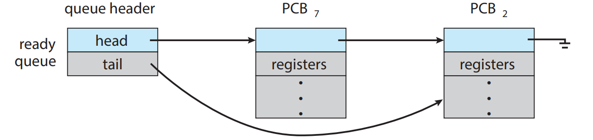

- 프로세스에 CPU 코어가 할당되면 프로세스는 잠시 동안 실행되어 결국 ⑴ 종료되거나 ⑵ 인터럽트 되거나 ⑶ I/O 요청의 완료 와 같은 특정 이벤트가 발생할 때까지 기다린다.
    - 이와 같이 특정 이벤트가 발생하기를 기다리는 프로세스는 **대기 큐(waite queue)**에 삽입된다.

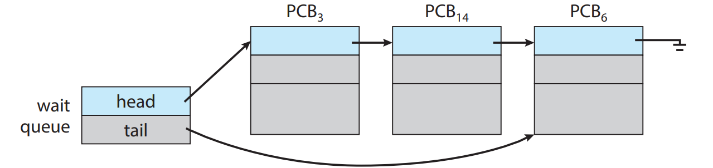

- **큐잉 다이어그램** = 프로세스 스케줄링 표현하는 그림
    - 원 : 큐에 서비스를 제공하는 자원
    - 화살표 : 프로세스 흐름을 나타낸다.

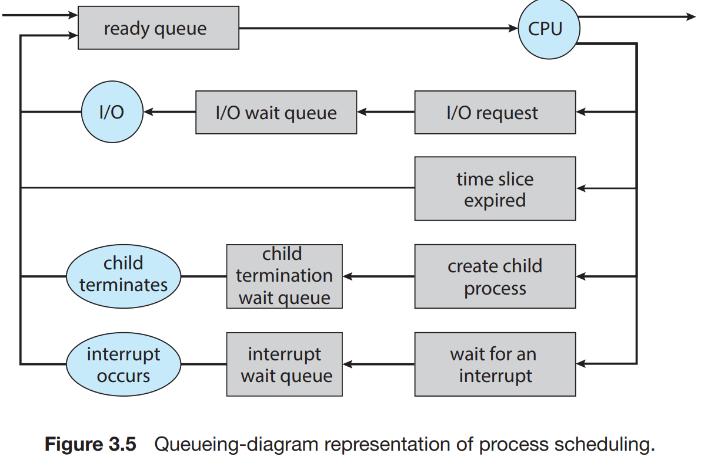

새 프로세스는 준비 큐에 놓인다. ⇒ 준비 큐
프로세스는 실행을 위해 선택되거나 or 디스패치 될 때까지 기다린다. ⇒ 대기 큐
프로세스에 CPU 코어가 할당되고 실행되면, 여러 이벤트 중 하나가 발생한다.
프로세스는 종료될 때까지 이 주기를 반복한다. 이떄 종료 시점에서 모든 큐에서 제거되고 PCB 및 자원이 반횐된다.

- 다이어그램 설명
    - 프로세스가 I/O 요청을 공표한 다음 I/O 대기 큐에 놓일 수 있다.
    - 프로세스는 새 자식 프로세스를 만든 다음 자식의 종료를 기다리는 동안 대기 큐에 놓일 수 있다.
    - 인터럽트 or 타임 슬라이스가 만료되어 프로세스가 코어에서 강제로 제거되어 준비 큐로 돌아갈 수 있다.

### 3.2.2 CPU 스케줄링

- **CPU 스케줄러**
    - 역할 : 준비 큐에 있는 프로세스 중에서 선택된 하나의 프로세스에 CPU 코어를 할당하는 것
        
        ⇒ 따라서, CPU 스케줄러는 CPU를 할당하기 위한 새 프로세스를 자주 선택해야 한다.
        
    - 일반적인 바운드 프로세스에 비해 CPU 스케줄러는 훨씬 더 자주 실행되지만 적어도 100ms마다 한 번씩 실행된다.

- 일부 운영체제는 **스와핑** 형태를 갖는다.
    - 프로세스를 메모리에서 디스크로 “스왑 아웃 (swap out)” 하면 현재 상태를 저장하고, 이후 디스크에서 메모리로 “스왑 인 (swap in)” 하여 상태를 복원할 수 있다 ⇒ **스와핑**

### 3.2.3 문맥 교환

- 인터럽트는 CPU 코어를 현재 작업에서 뺏어 내어 **커널 루틴**을 실행할 수 있게 한다.
    - 이러한 연산은 범용 시스템에서는 자주 발생한다.
    - 인터럽트가 발생하면 시스템은 인터럽트 처리가 끝난 후에 **문맥**을 복구할 수 있도록 현재 실행 중인 프로세스의 현재 문맥을 저장할 필요가 있다. 이는 PCB에 저장된다.
    
- **문맥** = CPU 레지스터의 값, 프로세스 상태, 메모리 관리 정보 등을 포함한다.
    - 커널 모드에 상관없이 CPU의 현재 상태를 저장하는 **작업을 수행**하고(state save), 나중에 연산을 재개하기 위해 상태 **복구 작업을 수행**한다(state restore).

- **문맥 교환** (context wsitch) = CPU 코어를 다른 프로세스로 교환하기 위해 이전의 프로세스의 상태를 보관하고 새로운 프로세스의 보관된 상태를 복구하는 작업
    - *운영체제가 복잡할수록, 문맥 교환 시 해야 할 작업의 양이 많아진다.*
    
    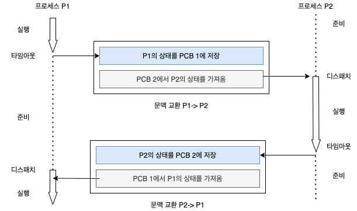
    
    - 작업과정
        - 커널은 과거 프로세스의 문맥을 PCB에 저장하고,
        - 실행이 스케줄된 새로운 프로세스의 저장된 문맥을 복구한다.
        - 문맥 교환이 진행될 동안, 시스템이 유용한 일을 못하기 때문에 문맥 교환시간은 순수한 오버헤드이다.

## 3.3 프로세스에 대한 연산

- 대부분 시스템 내의 프로세스들은 병행 실행될 수 있으며, 반드시 동적으로 생성되고 제거되어야 한다.
    - 그러므로 운영체제는 프로세스 생성 및 종료를 위한 기법을 제공해야 한다.

### 3.3.1 프로세스 생성

- 프로세스는 여러 개의 새로운 프로세스들을 생성할 수 있다.
    - 생성하는 프로세스를 **부모 프로세스**라고 부르고, 새로운 프로세스는 **자식 프로세스**라고 부른다.
    - 이 새로운 프로세스들은 각각 다시 다른 프로세스들을 생성할 수 있으며, 그 결과 프로세스의 **트리**를 형성한다.

- UNIX, Linux 및 Windows 와 같은 대부분의 현대 운영체제들은 유일한 프로세스 식별자(PID, Process IDentifier) 를 사용하여 프로세스를 구분한다.
    - pid는 보통 정수이다.
    - pid는 시스템의 각 프로세스에 고유한 값을 가지도록 할당한다.
    - pid를 통해 커널이 유지하고 있는 프로세스의 다양한 속성에 접근하기 위한 인덱스로 사용된다.

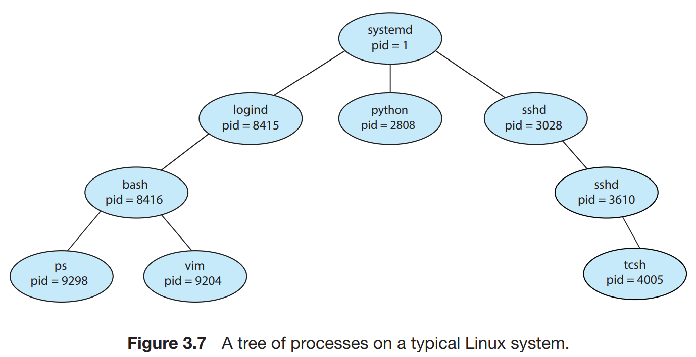

이 그림은 Linux 운영체제의 전형적인 프로세스 트리이다. ps -el 명령을 통해 현재 시스템에 활성화되어 있는 모든 프로세스의 정보를 나열할 수 있다.

- Linux 시스템의 프로세스 트리 설명
    - 언제나 pid가 1인 `systemd 프로세스`가 모든 사용자 프로세스의 루트 부모 프로세스 역할을 수행하고 시스템이 부트될 때 생성되는 첫 번째 사용자 프로세스이다.
    - 시스템이 부팅되면 `systemd 프로세스`는 다양한 사용자 프로세스를 생성한다.
        - web or print 서버, ssh 서버 등이 포함된다.
    - `systemd 프로세스` 의 자식 프로세스 `login 프로세스` 와 `sshd 프로세스`
        - `login 프로세스` : 시스템에 직접 로그인하는 클라이언트를 관리하는 책임을 진다.
        - `sshd 프로세스` : ssh(secure shell)을 사용하여 시스템에 접속하는 클라이언트의 관리를 책임진다.
    - `ps 명령어` : 프로세스들의 목록을 얻는다.

- 일반적으로 프로세스가 자식 프로세스를 생성할 때, 그 **자식 프로세스는 자신의 임무를 달성하기 위하여 자원이 필요하다.**
    - *ex) CPU 시간, 메모리, 파일, I/O 장치*
    - 이 자원은 운영체제로부터 직접 얻거나, 부모 프로세스가 가진 자원의 부분 집합만을 사용하도록 제한(시스템 과부하 방지)할 수 있다.
    
- 물리적, 논리적 자원을 제공하는 것 이외에 부모 프로세스는 자식 프로세스에 초기화 데이터(입력)를 전달할 수 있다.

- 프로세스가 새로운 프로세스를 생성할 때, 두 프로세스를 실행시키는 데 두 가지 가능한 방법이 존재한다.
    1. 부모는 자식과 병행하게 실행을 계속한다.
    2. 부모는 일부 또는 모든 자식이 실행을 종료할 때까지 기다린다.

- 새로운 프로세스들의 주소 공간 측면에서 볼 때 다음과 같은 두 가지 가능성이 있다.
    1. 자식 프로세스는 부모 프로세스의 복사본이다. (= 자식 프로세스는 부모와 똑같은 프로그램과 데이터를 가진다.)
    2. 자식 프로세스가 자신에게 적재될 새로운 프로그램을 가지고 있다.

- **UNIX 운영체제에서 새로운 프로세스 생성**
    
    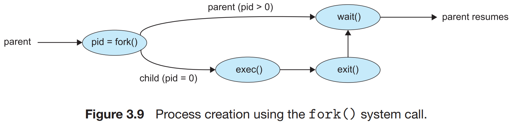
    
    - 새로운 프로세스는 fork() 시스템 콜로 생성되고, 원래 프로세스의 주소 공간의 복사본으로 구성된다.
    - exec() 시스템 콜은 이진 파일을 메로리로 적재(load)하고 그 프로그램을 실행을 시작한다.
        - 원래의 프로그램의 메모리 이미지를 파괴한다.
    - 부모 프로세스는 자식 프로세스가 실행되는 동안 할 일이 없으면 자식이 종료될 때까지 준비 큐에서 자신을 제거하기 위해 wait() 시스템 콜을 한다.

- **Windows 운영체제에서 새로운 프로세스의 생성**
    - Windows API의 CreateProcess() 함수를 이용하여 새로운 프로세스를 생성한다.
        - CreateProcess() API는 자식 프로세스가 생성될 때 주소 공간에 명시된 프로그램을 적재한다. (10개 이상의 매개변수를 요구)
    - WaitForSingleObject() 함수는 자식 프로세스의 핸들을 전달받고 이 프로세스가 종료되기를 기다린다.

### 3.3.2 프로세스 종료

- 프로세스가 마지막 문장의 실행을 끝내고, exit 시스템 콜을 사용하여 운영체제에 자신의 삭제를 요청하면 종료한다.
    - 물리 메모리와 가상 메모리, 열린 파일, I/O 버퍼를 포함한 프로세스의 모든 자원이 할당 해제되도 운영체제로 반납된다.
- 다른 방법으로, 한 프로세스는 적당한 시스템 콜을 통해서 다른 프로세스의 종료를 유발할 수 있다.
    - 종료될 프로세스의 부모만이 호출할 수 있다.
    
- 부모는 다음과 같은 이유로 인하여 자식 중 하나의 실행을 종료할 수 있다.
    - 자식이 자신에게 할당된 자원을 초과하여 사용할 때
        
        → 이때는 부모가 자식들의 상태를 검사할 수 있는 방편이 주어져야 한다.
        
    - 자식에게 할당된 태스크(= 프로세스)가 더 이상 필요 없을 때
    - 부모가 exit를 하는데, 운영체제는 부모가 exit 한 후에 자식이 실행을 계속하는 것을 허용하지 않는 경우

- 몇몇 시스템에서는 부모 프로세스가 종료한 이후에 자식 프로세스가 존재할 수 없다.
    - 이러한 시스템에서는 프로세스가 종료되면, 그로부터 비롯된 모든 자식 프로세스들도 종료되어야 한다. ⇒ **연쇄식 종료** (cascading termi-nation)

- 프로세스가 종료하면 사용하던 자원은 운영체제가 되찾아 간다.
    - 그러나 프로세스의 종료되었지만 부모 프로세스가 아직 wait() 를 호출하지 않은 프로세스를 **좀비(zombie) 프로세스**
    - 부모 프로세스가 wait()을 호출해서 자식 프로세스의 종료를 기다리지 않고 자신을 종료해버린다면 이 상황에 부닥친 자식 프로세스를 **고아(orphan) 프로세스**
        
        ┕ UNIX의 경우 고아 프로세스는 init 프로세스(Linux의 systemd와 동일)가 상속하고 종료를 관리한다.
        

- **Android 프로세스 계층**
    - Android 는 임의의 프로세스를 종료하지 않고 프로세스의 중요도 계층을 식별했으며, 시스템이 프로세스를 종료하여 새로운 또는 보다 중요한 프로세스를 위한 자원을 확보해야 할 경우 중요도가 낮은 프로세스부터 종료한다.
    - 프로세스 중요도 순서
        1. 전경 프로세스 (forground process)
        2. 가시적 프로세스 (visible process)
        3. 서비스 프로세스 (service process)
        4. 백그라운드 프로세스 (background process)
        5. 빈 프로세스 (empty process)
        
        ※ 시스템 자원을 회수해야만 하는 경우,
        
        Android는 먼저 empty process → background process → … 순서로 종료한다.
        
    

## 3.4 프로세스 간 통신

- 운영체제 내에서 실행되는 병행 프로세스들은 독립적이거나 or 협력적인 프로세스들일 수 있다.
    - 프로세스가 시스템에서 실행 중인 다른 프로세스들과 데이터를 공유하지 않는 프로세스는 *독립적*이다.
    - 프로세스가 시스템에서 실행 중인 다른 프로세스들에 영향을 주거나 받는 프로세스는 *협력적*이다.
    - 다른 프로세스들과 자료를 공유하는 프로세스는 *상호 협력적인* 프로세스이다.

- 프로세스 협력을 허용하는 환경을 제공하는 이유
    - **정보 공유** : 여러 응용 프로그램이 동일한 정보에 흥미를 느낄 수 있으므로, 그러한 정보를 병행적으로 접근할 수 있는 환경을 제공해야 한다.
    - **계산 가속화** : 만일 우리가 특정 태스크를 빨리 실행하고자 한다면, 우리는 그것을 서브태스크로 나누어 이들 각각이 다른 서브태스크들과 병렬로 실행되게 해야 한다.
    - **모듈성** : 시스템 기능을 별도의 프로세스들 or 스레드들로 나누어, 모듈식 형태로 시스템을 구성하기를 원할 수 있다.

- 협력적 프로세스들은 데이터를 교환할 수 있는, 즉 서로 데이터를 보내거나 받을 수 있는 **프로세스 간 통신**(**IPC**, Interprocess Communication) 기법이 필요하다.

- 프로세스 간 통신 모델 2가지
    - **공유 메모리 모델**
        
        : 협력 프로세스들에 의해 공유되는 메모리의 영역이 구축된다.
        
        : 프로세스들은 그 영역에 데이터를 읽고 쓰고 함으로써 정보를 교환할 수 있다.
        
        : 공유 메모리 영역을 구축할 때만 시스템 콜이 필요하다.
        
    - **메시지 전달 모델**
        
        : 통신은 협력 프로세스들 사이에 교환되는 메시지를 통해 이루어진다.
        
        : 분산 시스템에서 공유메모리보다 구현하기 쉽다.
        

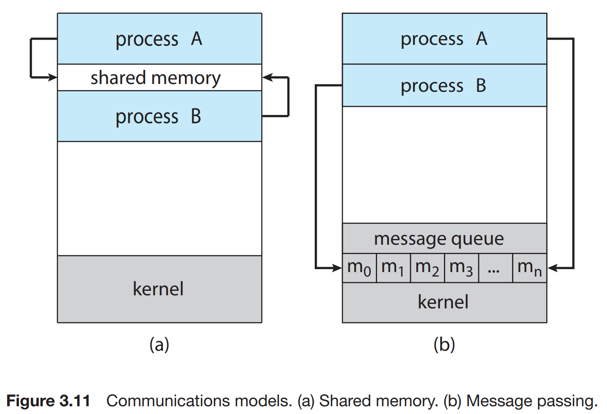

## 3.5 공유 메모리 시스템에서의 프로세스 간 통신

┕ IPC, In Shared-Memory Systems

 

- 공유 메모리를 사용하는 프로세스 간 통신에서는 통신하는 프로세스들이 공유 메모리 영역을 구축해야 한다.
- **통신 공유 메모리 영역**은 공유 메모리 세그먼트를 생성하는 프로세스의 주소 공간에 위치한다.
    - 이 공유 메모리 세그먼트를 이용하여 통신하고자 하는 다른 프로세스들은 이 세그먼트를 자신의 주소 공간에 추가하여야 한다.

- 협력하는 프로세스의 개념을 설명하기 위해서, 협력하는 프로세스의 일반적인 패러다임인 생산자-소비자 문제를 생각해 보자.
    - **생산자 프로세스**는 정보를 생산하고, **소비자 프로세스**는 정보를 소비한다.
    
- 생산자-소비자 프로세스의 문제 
: 생성자가 데이터를 생성하면 소비자는 데이터를 소비한다.
    
    > *일반적으로 생산하는 속도와 소비하는 속도에서 차이가 발생한다. 실제로 생산되는 속도가 소비하는 속도보다 빠른 경우가 많아서 생산된 데이터는 바로 소비되지 못한다.*
    > 
    
- 생산자-소비자 프로세스 문제 해결책
    
    : 공유 메모리 즉, 버퍼를 사용하는 것이다.
    : 생산자가 데이터를 생산하면 버퍼에 보관하게 되고, 소비자는 버퍼에서 데이터를 빼어 사용한다.
    
- 버퍼의 종류 2가지
    - **무한 버퍼** (unbounded buffer) = 버퍼의 크기에 실질적인 한계가 없다.
    : 소비자는 새로운 항목을 기다려야만 할 수도 있지만, 생산자는 항상 새로운 항목을 생산할 수 있다.
    - **유한 버퍼** (bounded buffer) = 버퍼의 크기가 고정되어 있다.
    : 버퍼가 비어 있으면 소비자는 반드시 대기해야 하며, 모든 버퍼가 채워져 있으면 생산자가 대기해야 한다.
        
        … 현실 시스템은 버퍼의 크기가 유한하기 때문에 대부분 유한 버퍼로 사용된다.
        

- 생산자와 소비자가 병행하게 공유 버퍼를 접근하는 상황에 대한 고려 즉, **동기화**도 고려해야만 한다. (Locking을 사용할 수 있다.)

## 3.6 메시지 전달 시스템에서의 프로세스 간 통신

┕ IPC, In Message-Passing Systems

- **메시지 전달 방식**은 동일한 주소 공간을 공유하지 않고도 프로세스들이 통신을 하고, 그들의 동작을 동기화할 수 있도록 허용하는 기법을 제공한다.
    - 통신하는 프로세스들이 네트워크에 의해 연결된 다른 컴퓨터들에 존재할 수 있는 *분산 환경에 유용하다.*
    - 만약 프로세스 P와 Q가 통신을 원하면, 반드시 서로 메시지를 보내고 받아야 한다.
    ⇒ 이들 사이에 *통신 연결* (communication link) 이 설정되어야 한다.

- 통신 연결 논리적 구현 방법
    - 직접 or 간접 통신
    - 동기식 or 비동기식 통신
    - 자동 or 명시적 버퍼링

### 3.6.1 명명 _ Naming

- 통신을 원하는 프로세스들은 서로를 가리킬 방법이 있어야 한다.

> **직접 통신**
> 
- ***직접 통신***하에서, 통신을 원하는 각 프로세스는 통신의 수신자 or 송신자의 이름을 명시해야 한다.
    - send(P, message) : 프로세스 P에 메시지를 전송한다.
    - receive(Q, message) : 프로세스 Q로부터 메시지를 수신한다.

- 직접 통신 연결 특성
    - 통신을 원하는 각 프로세스의 쌍들 사이에 연결이 자동으로 구축된다. 프로세스들은 통신하기 위해 상대방의 신원(identity)만 알면 된다.
    - 연결은 정확히 두 프로세스 사이에만 연관된다.
    - 통신하는 프로세스들의 각 쌍 사이에는 정확하게 하나의 연결이 존재해야 한다.

- 주소 방식에서 *대칭성*을 보인다.
    - 송신자와 수신자 프로세스가 모두 통신하려면 상대방의 이름을 제시해야 한다.
        
        … 주소 방식에서 대칭성을 보이나, 주소 지정 시에 *비대칭*을 사용할 수도 있다.
        
    - send(P, message) : 메시지를 프로세스 P에 전송한다.
    - receive(id, message) : 임의의 프로세스로부터 메시지를 수신한다. 변수 id는 통신을 발생시킨 프로세스의 이름으로 설정된다.

> **간접 통신**
> 
- ***간접 통신***에서 메시지들은 메일박스 or 포트로 송신되고, 그것으로부터 수신된다.
    - 메일 박스는 추상적으로 프로세스들에 의해 메시지들이 넣어지고, 메시지들이 제거될 수 있는 객체라고도 볼 수 있다.
    
- 각 포트(메일박스)는 고유의 id를 가진다. 두 프로세스들이 공유 포트(메일박스)를 가질 때만 이들 프로세스가 통신할 수 있다.
    - send(A, message) : 메시지를 메일박스로 A로 송신한다.
    - receive(A, message) : 메시지를 메일박스로 A로부터 수신한다.

- 간접 통신 연결 성질
    - 한 쌍의 프로세스들 사이의 연결은 이들 프로세스가 공유 메일박스를 가질 때만 구축된다.
    - 연결은 두 개 이상의 프로세스들과 연관될 수 있다.
    - 통신하고 있는 각 프로세스 사이에는 다수의 서로 다른 연결이 존재할 수 있고, 각 연결은 하나의 메일박스에 대응된다.

- 메일박스는 한 프로세스 or 운영체제에 의해 소유될 수 있다.
    - 각 메일박스가 고유한 소유자를 가지고 있기 때문에, 이 메일박스로 보내진 메시지를 어느 프로세스가 수신할 지에 대한 혼란이 있을 수 없다.
    - 메일박스를 소유하고 있는 프로세스가 종료할 때, 메일 박스는 사라진다.

- 운영체제는 반드시 다음 기법을 제공해야 한다.
    - 새로운 매일박스를 생성한다.
    - 메일박스를 통해 메시지를 송신하고 수신한다.
    - 메일박스를 삭제한다.

### 3.6.2 동기화 _Synchronization

- 프로세스 간의 통신은 send와 receive 프리미티브에 대한 호출에 의해 발생한다.
    - 각 프리미티브를 구현하기 위한 서로 다른 설계 옵션이 있다.
    - 메시지 전달은 **봉쇄형** (block-ing) 이거나 **비봉쇄형** (nonblocking) 방식으로 전달된다.
        
        ⇒ 이 두 방식은 각각 **동기식, 비동기식** 이라고도 알려져 있다.
        
    
- 설계 옵션 방식
    - 봉쇄형 보내기 
    : 송신하는 프로세스는 메시지가 수신 프로세스 or 메일박스에 의해 수신될 때까지 봉쇄된다.
    - 비봉쇄형 보내기
    : 송신하는 프로세스가 메시지를 보내고 작업을 재시작한다.
    - 봉쇄형 받기
    : 메시지가 이용 가능할 때까지 수신 프로세스가 봉쇄된다.
    - 비봉쇄형 받기
    : 송신하는 프로세스가 유효한 메시지 or 널(null)을 받는다.
    
- send()와 receive()가 모두 봉쇄형 일 때, 우리는 송신자와 수신자 간에 **랑데부**(rendezvous)를 하게 된다.

### 3.6.3 버퍼링 _Buffering

- 통신의 직간접 상관없이 통신하는 프로세스들에 의해 교환되는 메시지는 임시 큐에 들어있다.
- 큐 구현 방식
    - 무용량(zero capacity)
        
        : 큐의 최대 길이가 0이다.
        
        : 즉, 링크는 자체 안에 대기하는 메시지들을 가질 수 없다.
        
    - 유한 용량(bounded capacity)
        
        : 큐는 유한한 길이 n을 가진다.
        
        : 즉, 최대 n개의 메시지가 그 안에 들어 있을 수 있다.
        
    - 무한 용량(unbounded capacity)
        
        : 큐는 잠재적으로 무한한 길이를 가진다.
        
        : 따라서 메시지들이 얼마든지 큐 안에서 대기할 수 있다.
        

## 3.7 IPC 시스템의 사례

### 3.7.1 POSIX 공유 메모리

- POSIX 공유 메모리는 메모리-상 파일을 사용하여 구현된다.
- 메모리-사상 파일은 공유 메모리의 특정 영역을 파일과 연관시킨다.
    1. 프로세스는 `fd = shm_open(name, O_CREAT | O_RDWR, 0666)` 와 같이 시스템 콜을 사용하여 공유 메모리 객체를 생성한다.
    2. `ftruncate(fd, SIZE)`와 같은 함수를 사용하여 공유 메모리 객체의 크기를 바이트 단위로 설정한다.
    3. `ptr = (char *)mmap(0, SIZE, PROT_READ | PROT_WRITE, MAP_SHARED, fd, 0)`와 같은 함수를 사용하여 공유 메모리 객체를 포함하는 memory-mapped 파일을 구축한다.

### 3.7.2 Mach 메시지 전달

- Mach 커널은 프로세스와 유사하지만 제어 스레드가 많고 관련 자원이 적은 다중 태스크의 생성 및 제거를 지원한다.

- 모든 태스크 간 통신을 포함하여 Mach에서 대부분의 통신은 *메시지*로 수행한다.
    - Mach에서 *포트(port)*라고 하는 메일박스로 메시지를 주고 받는다.
    - 포트는 크기가 정해저 있고 단방향이다.
    - 양방향 통신의 경우 메시지가 한 포트로 전송되고 응답이 별도의 응답 포트로 전송된다.
    - 각 포트에는 여러 송신자가 있을 수 있지만 수신자는 오직 하나만 존재한다.

- 각 포트에는 그 포트와 상호 작용하는데 필요한 자격을 식별하는 **포트 권한 집합**이 연관된다.

- 태스크가 생성되면 `Task Self` 포트와 `Notify` 포트라는 두 개의 특별한 포트도 생성된다.
    - 커널은 Task Self 포트에 대한 수신 권한을 가지고 있어 태스크가 커널에 메시지를 보낼 수 있다.
    - 커널의 이벤트 발생 알림을 작업의 Notify 포트로 보낼 수 있다.
    
- mach_port_allocate() API는 새 포트를 작성하고 메시지 큐를 위한 공간을 할당한다. 또한 포트에 대한 권한을 식별한다.

- 각 태스크는 **부트스트랩 포트**에 액세스 할 수 있어서 태스크가 생성한 포트를 시스템 전체의 **부트스트랩 서버**에 등록할 수 있다.
    - 포트가 부트스트랩 서버에 등록되면 다른 태스크가 이 레지스트리에서 포트를 검색하여 포트로 메시지를 보낼 수 있는 권한을 얻을 수 있다.

- mach_msg() 함수는 메시지를 보내고 받는 표준 API이다.
    - mach_msg()가 호출되면 이는 mach_msg_trap() 함수를 호출하고,
    mach_msg_trap()은 mach_msg_overwrite_trap()함수를 호출하여 메시지의 실제 전달을 처리한다.
    
- 포트(메일박스)가 가득 찼을 경우 mach_msg()에서 설정할 수 있는 옵션
    1. 큐에 공간이 생길 때까지 무기한 기다린다.
    2. 최대 n 밀리초 동안 기다린다.
    3. 기다리지 말고 즉시 복귀한다.
    4. 메시지를 일시적으로 캐시 한다. 메시지가 전송되는 큐가 가득 차더라도 운영체제에 전달하여 보존한다.

- 메시지 시스템의 주요 문제점은 일반적으로 송신자의 포트에서 수신자의 포트로 메시지를 복사해야 하므로 발생하는 성능 저하이다.
    - 해결 : 가상 메모리 관리 기술을 사용하면 같은 시스템 내의 메시지 전송간에 성능 저하를 최소화 할 수 있다.

### 3.7.3 Windows

- Windows 운영체제는 **모듈화를 이용하여 향상**시키고 새로운 기능을 **구현하는 시간을 감소**시킨 최신 설계의 예이다.
    - 다중 운영 환경 or 서브시스템을 지원한다.

- Windows의 메시지 전달 설비는 **고급 로컬 프로시저 호출 설비**(**ALPC**, Advanced Local Procedure Call Facility) 라고 불린다.
    - ALPC는 동일 기계 상에 있는 두 프로세스 간의 통신에 사용한다.
    - 두 프로세스 간에 연결을 구축하고 유지하기 위해 포트 객체를 사용한다.
    - 연결 포트와 통신 포트를 사용한다.

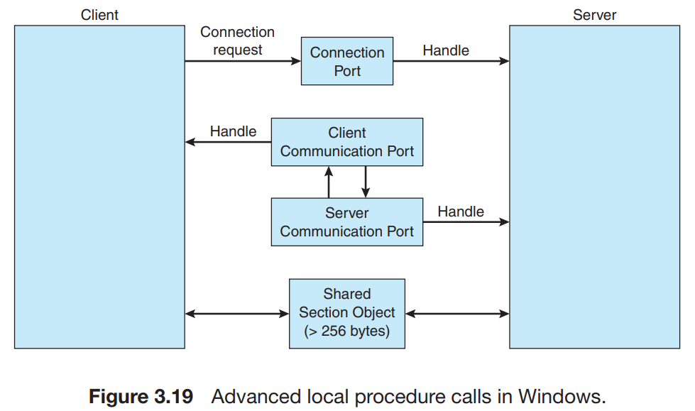

- ALPC 과정 설명
    
    > 클라이언트가 서브 시스템으로부터 서비스를 원할 경우, 다음과 같이 진행된다.
    
    서버의 연결 포트 객체에 대한 핸들을 열고 연결 요청을 보낸다 
    → 서버는 채널을 생성, 핸들을 클라이언트에게 반환한다.
    → 채널은 한 쌍의 사적인 통신 포트로 구성된다. 
       (하나는 클라이언트→서버 메시지 전송 포트, 하나는 서버→클라이언트 메시지 전송 포트)
    
    *※ 통신 채널은 클라이언트와 서버가 응답 메시지를 기다리고 있는 동안에도 다른 요청을 받아들일 수 있도록 콜백 기법을 제공한다.*
    > 

- ALPC 채널이 생성되면 다음 3가지 중 하나의 메시지 전달 기법이 선택된다.
    1. 256byte까지의 작은 메시지의 경우, 포트의 메시지 큐가 중간 저장소로 사용되고, 메시지는 프로세스에서 프로세스로 복사된다.
    2. 대용량 메시지는 반드시 섹션 객체(section object)를 통하여 전달되어야 한다. 
    … 섹션 객체란 채널과 연관된 공유 메모리의 영역을 말한다.
    3. 데이터의 양이 너무 많아서 섹션 객체에 저장될 수 없을 경우, 서버 프로세스가 클라이언트의 주소 공간을 직접 읽거나 쓸 수 있는 API를 사용할 수 있다.

- 클라이언트 채널을 설정할 때 대용량 메시지 전송이 필요한지 결정해야 한다.
    - 즉, 대용량 메시지 전송의 필요 여부를 결정하는 것이다.

### 3.7.4 파이프

- **파이프**는 두 프로세스가 통신할 수 있게 하는 전달자로서 동작한다.
    - 초기 UNIX 시스템에서 제공하는 IPC 기법의 하나였다.
    - 구현하기 전에 고려해야 할 4가지 문제
        1. 파이프가 단방향 통신 or 양방향 통신을 허용하는가 ?
        2. 양방향 통신이 허용된다면 반이중(half duplex) 방식인가, 전이중(full duplex) 방식인가 ?
        … 반이중 방식은 한순간에 한 방향 전송만 가능
        … 전이중 방식은 동시에 양방향 데이터 전송이 가능
        3. 통신하는 두 프로세스 간에 *부모-자식*과 같은 특정 관계가 존재해야만 하는가 ?
        4. 파이프는 네트워크를 통하여 통신이 가능한가, 아니면 동일한 기계 안에 존재하는두 프로세스끼리만 통신할 수 있는가 ?

**3.7.4.1 일반 파이프**

- 일반 파이프는 생산자-소비자 형태로 두 프로세스 간의 통신을 허용한다.
    - 생산자는 파이프의 한 종단(쓰기 종단)에 쓰고, 소비자는 다른 종단(읽기 종단)에서 읽는다.
    - 결과적으로 일반 파이프는 한쪽으로만 데이터를 전송할 수 있으며, 오직 단방형 통신만을 가능하게 한다.
    - 양방향 통신이 필요하다면 각각 다른 방향으로 데이터를 전송할 수 잇는 두 개의 파이프를 사용해야 한다.
    
- **일반 파이프는 파이프를 생성한 프로세스 이외에는 접근할 수 없다.**
    - 따라서 부모 프로세스가 파이프를 생성하고 fork()로 생성한 자식 프로세스와 통신하기 위해 사용한다.

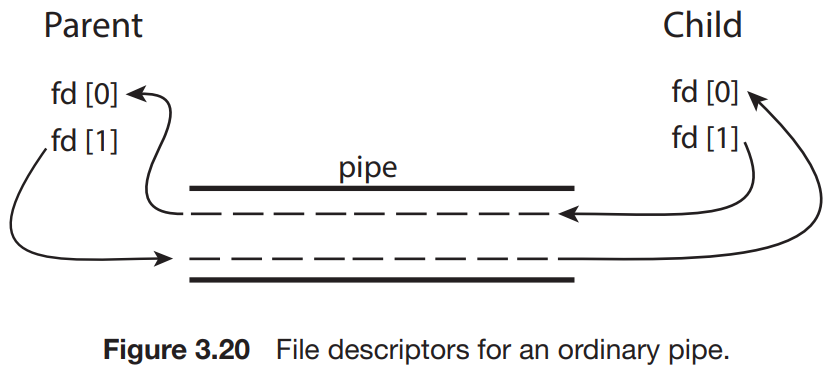

- 일반 파이프를 위한 파일 디스크립터를 나타낸 그림이다.
    - fd 배열의 파일 디스크립터와 부모 및 자식 프로세스의 관계를 보여준다.
    - 부모가 파이프의 쓰기 종단(fd[1])에 데이터를 쓰면 파이프의 읽기 종단(fd[0])에서 자식이 읽을 수 있다.

- Windows 시스템의 일반 파이프는 **익명 파이프**(anonymous pipe)라고 불리며 UNIX의 대응되는 파이프와 유사하게 동작한다.
    - 이 파이프는 단방향이고, 통신하는 두 프로세스는 부모-자식 관계여야 한다.
    - 이 유형의 파이프는 동일한 기계상의 두 프로세스끼리만 통신이 가능하다는 것을 의미한다.

**3.7.4.2 지명 파이프**

- **지명 파이프**(named pipes)는 일반 파이프보다 더 강력한 통신 도구를 제공한다.
    - 통신은 양방향으로 가능하며, 부모-자식 관계도 필요하지 않다.
    - 지명 파이프가 구축되면 여러 프로세스들이 이를 사용하여 통신할 수 있다.
    - 통신 프로세스가 종료하더라도 지명 파이프는 계속 존재하게 된다.
    - UNIX와 Windows 시스템은 구현상에 차이점은 있지만, 모두 지명 파이프를 지원한다.

- 지명 파이를 UNIX에선 FIFO라고 부른다.
    - 생성되면 지명 파이프는 파일 시스템의 보통 파일처럼 존재한다.
    - 시스템 콜로 생성 및 조작되며 명시적으로 파일 시스템에서 삭제될 때까지 존재한다.
    - FIFO는 반이중 전송만이 가능하다.
    만약 서로 다른 기계에 존재하는 프로세스 사이에 통신이 필요하다면 소켓을 사용해야 한다.

> ***반이중 통신 
=** 양방향으로 데이터가 전송될 수는 있으나 양쪽에서 동시에 전송하는 것은 불가능한 방식

**전이중 통신 
=** 양쪽에서 동시에 데이터를 전송할 수 있는 방식*
> 

- Windows 시스템의 지명 파이프는 전이중 통신을 허용하며, 통신하는 두 프로세스는 같은 기계 또는 다른 기계상에 존재할 수 있다.
    - Windows 시스템은 바이트-단위 or 메시지-단위 데이터의 전송을 허용한다.

<aside>
💡 ***실제 파이프 사용 예시 in UNIX***

*파이프는 UNIX 명령어 라인 환경에서 한 명령의 출력이 다른 명령의 입력으로 사용되는 상황에서 자주 사용된다. 파이프는 명령어 라인에서 | 문자를 사용하여 구축될 수 있다.*

*`ex) ls | less`*

*이 시나리오에서 ls 명령은 생산자 역할을 하며 출력은 less 명령에 의해 소비된다.*

*Dos Shell도 파이프를 구축하기 위하여 | 문자를 사용한다.*

*`ex) dir | more`*

</aside>

## 3.8 클라이언트 서버 환경에서 통신

- 클라이언트 서버에서 사용할 수 있는 **두 가지 다른 통신 전략(Socket, RPC)**에 대해 알아보자.

### 3.8.1 소켓

- **소켓**(socket)은 통신의 극점(endpoint)을 뜻한다.
    - 두 프로세스가 네트워크 상에서 통신을 하려면 양 프로세스마다 하나씩, 총 두개의 소켓이 필요해진다.
    - 각 소켓은 IP 주소와 포트 번호 두 가지를 접합해서 구별한다.

- 일반적으로 소켓은 클라이언트-서버 구조를 사용한다.
    - 서버는 지정된 포트에 클라이언트 요청 메시지가 도착하기를 기다리게 된다.
        
        … 요청이 수신되면 서버는 클라이언트 소켓으로부터 연결 요청을 수락함으로써 연결이 완성된다.
        
    - 클라이언트 프로세스가 연결을 요청하면 호스트 컴퓨터가 포트 번호를 부여한다.
        
        … 이 번호는 1024보다 큰 임의의 정수가 된다.
        

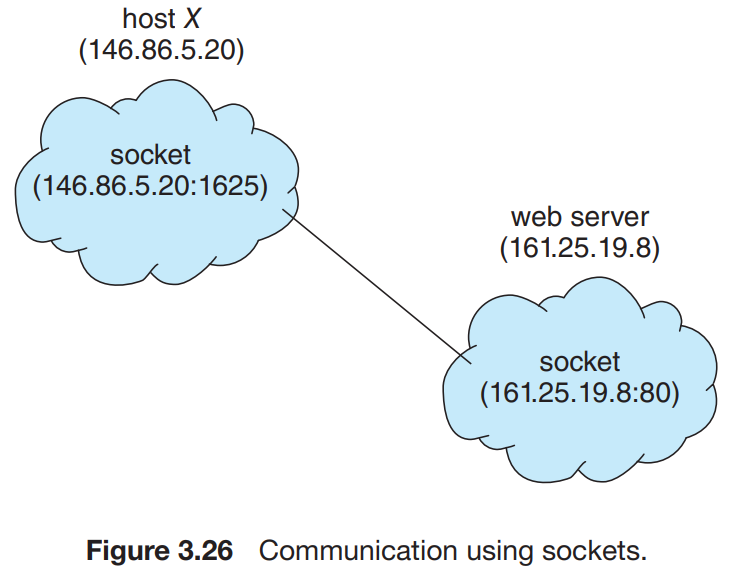

- 소켓을 사용한 통신 설명
    1. 클라이언트 프로세스의 연결 요청하면 호스트 컴퓨터가 포트 번호 부여
        
        … 호스트 X는 클라이언트에 포트 1625를 부여한다 (웹 서버는 포트 80을 listen 하고 있다.)
        
    2. 연결은 이 두 개의 소켓 호스트 X의 (146.86.5.20:1625)와 웹 서버의 (161.25.19.8:80)으로 구성된다.
    3. 두 호스트 사이에 패킷들이 오갈 때 그 패킷들은 이 목적지 포트 번호가 지정하는 데 따라 적절한 프로세스로 배달된다.

- 모든 연결은 유일해야 한다.
    
    ex) 호스트에 있는 다른 클라이언트 프로세스가 3.26 그림과 동일한 웹 서버와 통신을 하면 그 클라이언트는 1024보다 크고 1625가 아닌 다른 포트 번호를 부여받게 된다.
    
    ⇒ ***모든 연결이 유일한 소켓 쌍으로 구성되는 것을 보장한다 !***
    

- 소켓을 이용한 통신은 분산된 프로세스 간에 널리 사용되고 효율적이기는 하지만 너무 낮은 수준이다.
    - 소켓은 스레드 간에 구조화되지 않은 바이트 스트림만을 통신하도록 하기 때문이다.
    - 이러한 원시적인 바이트 스트림 데이터를 구조화하여 해석하는 것은 클라이언트와 서버의 책임이 된다.
    - 따라서 더욱 높은 수준의 통신 기법인 RPC을 살펴보자.

### 3.8.2 원격 프로세스 호출

> ***원격 프로시저 호출(RPC)**
= 별도의 원격 제어를 위한 코딩 없이 다른 주소 공간에서 함수나 프로시저를 실행할 수 있게하는 프로세스 간 통신 기술이다. 다시 말해, 원격 프로시저 호출을 이용하면 프로그래머는 함수가 실행 프로그램에 로컬 위치에 있든 원격 위치에 있든 동일한 코드를 이용할 수 있다.*
> 

- 원격 서비스와 관련한 가장 보편적인 형태 중 하나는 RPC(Remote Procedure Calls) 패러다임으로서, 네트워크에 연결된 두 시스템 사이의 통신에 사용하기 위하여 프로시저 호출 기법을 추상화하는 방법으로 설계되었다.

- RPC에서는 프로세스들이 서로 다른 시스템 위에서 돌아가기 때문에 원격 서비스를 제공하기 위해서는 메시지 기반 통신을 해야 한다.

- RPC 통신에서 전달되는 **메시지는 구조화 되어** 있고, **데이터 패킷 수준을 넘어선다.**
    - 각 메시지에는 원격지 포트에서 listen 중인 **RPC 디먼**의 주소가 지정되어 있고 **실행되어야 할 함수의 식별자**, 그리고 그 **함수에게 전달되어야 할 매개변수**가 포함된다.
    - 이후에 요청된 함수가 실행되고 **어떤 출력이든지 별도의 메시지를 통해 요청자에게 반환**된다.
    
- 원격 프로세스가 어떤 서비스를 받고자 하면 그 서비스에 대응되는 RPC 디먼이 listen하고 있는 포트 주소로 메시지를 보내야 한다. (보통 이를 도와주기 위해 **matchmaker**가 존재한다.)

> ***matchmaker (디먼)**
= 클라이언트가 원하는 RPC Daemon의 포트번호를 알려주는 랑데부용 디먼이다.*
> 

- RPC는 클라이언트가 원격 호스트의 프로시저 호출하는 것을 마치 자기의 프로시저 호출하는 것처럼 해준다.
    - RPC 시스템은 클라이언트 쪽에 **스텁을 제공**하여 통신을 하는데 필요한 자세한 사항들을 숨겨준다.

- 클라이언트 측에서는 서버에게 데이터를 보내기 전 매개변수 정돈 작업의 일환으로 전송할 데이터를 **기종 중립적인 XDR 형태**로 바꾸어서 보낸다.

- RPC는 분산 파일 시스템(DFS, Distributed File System)을 구현하는 데 유용하다. DFS는 몇 개의 RPC daemon과 클라이언트로 구현할 수 있다.

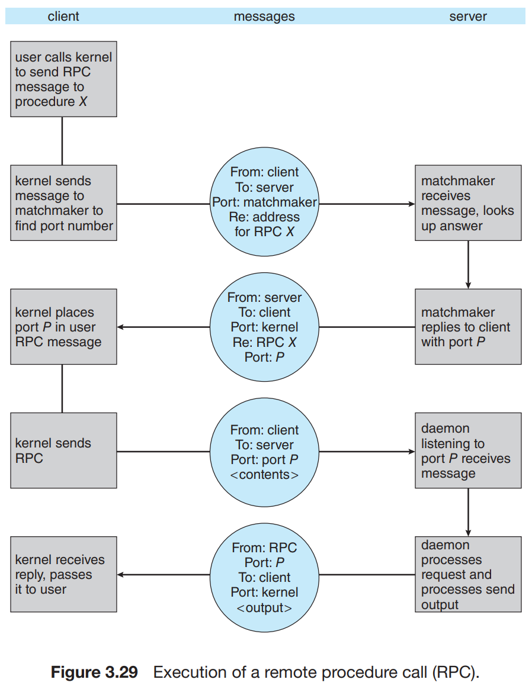

RPC 실행 과정

**3.8.2.1 Android RPC**

- Android 운영체제는 바인터 프레임워크에 포함된 풍부한 IPC 기법의 집합을 가지고 있다.
    - 이 중 RPC는 프로세스가 다른 프로세스의 서비스를 요청할 수 있게 한다.

- Android는 응용 프로그램 구성요소를 Android 응용 프로그램에 유용성을 제공하는 기본 빌딩 블록으로 정의한다.
    - 앱은 여러 응용 프로그램 구성요소를 결합하여 필요한 기능을 구현할 수 있다.

⇒ 이러한 응용 프로그램 구성요소 중 하나는 사용자 인터페이스가 없지만 백그라운드로 실행되며 장기 실행 연산을 실행하거나 원격 프로세스에 대한 작업을 수행하는 **서비스**이다.

┕ 이 서비스를 이용해 백그라운드에서 음악을 재생하고 다른 프로세스 대신 네트워크 연결을 통해 데이터를 검색하여 데이터를 다운로드 할 때 다른 프로세스가 실행 중단되는 것을 방지할 수 있다.