# Chap4 Threads & Councurrency

## 4.1 개요

- 대부분의 현대 운영체제는 한 프로세스가 다중 스레드를 포함하는 특성을 제공한다.
- **스레드**는 CPU 이용의 기본 단위이다.
    - 스레드 ID, 프로그램 카운터(PC), 레지스터 집합, 스택으로 구성된다.

- 전통적인 프로세스는 하나의 제어 스레드를 가지고 있지만, 현대 프로세스는 다수의 제어 스레드를 가지고 있기 때문에 해당 **프로세스는 동시에 하나 이상의 작업을 수행할 수 있다.**

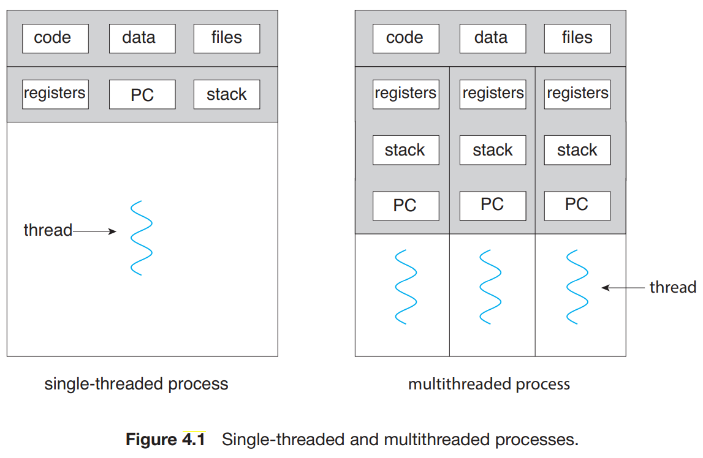

### 4.1.1 동기 _Movation

- 현대에 거의 모든 SW 응용들은 다중 스레드를 이용한다.
    - 하나의 응용은 몇 개의 실행흐름(스레드)을 가진 독립적인 프로세스로 구현된다.

- 응용은 다중 코어 시스템에서 처리 능력을 향상시키도록 설계될 수 있다.
    - 이러한 응용은 다중 계산 코어를 사용하여 다수의 CPU-집중 작업을 병렬로 처리할 수 있다.

> *ex) 웹 서버
 **웹 서버**는 클라이언트로부터 웹 페이지나 이미지, 소리 등에 대한 요청을 받는다. 하나의 분주한 서버는 여러 개의 클라이언트들이 병행하게 접근할 수 있다. 만약 웹 서버가 전통적인 단일 스레드 프로세스로 작동한다면, 자신의 단일 프로세스로 한 번에 하나의 클라이언트만 서비스할 수 있게 되어 클라이언트는 자신의 요구가 서비스되기까지 매우 긴 시간을 기다려야 한다.*
> 
> 
> *이러한 단점을 개선하기 위해서 여러 요청을 수행할 별도의 프로세스들을 만들 수도 있지만 이는 많은 리소스가 필요함으로 많은 오버헤드가 발생한다.*
> 
> *프로세스를 새로 만드는 것 보다 **프로세스의 개념을 확장하여 한 프로세스가 다수의 실행 스레드를 가질 수 있도록 허용한다. 그들은 프로세스가 한 번에 하나 이상의 일을 수행할 수 있도록 허용함으로써 문제를 해결한다.***
> 
> *이를 웹 서버에 적용 시켜보면, 웹 서버가 다중 스레드화 되게끔 만들어서 서버는 클라이언트의 요청을 listen 하는 별도의 스레드를 생성한다. 요청이 들어오면 다른 프로세스를 생성하는 것이 아니라, 요청을 서비스할 새로운 스레드를 생성하고 추가적인 요청을 listen 하기 위한 작업을 재개한다*
> 
> 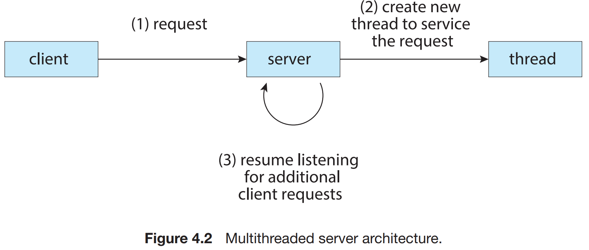
> 

- 대부분의 운영체제 커널도 일반적으로 다중 스레드이다.
    - 예를 들어 Linux 시스템에서 시스템을 부트하는 동안 여러 커널 스레드가 생성된다. 각 스레드는 장치 관리, 메모리 관리 또는 인터럽트 처리와 같은 특정 작업을 수행한다.

### 4.1.2 장점

- 다중 스레드 프로그래밍의 이점은 크게 4가지로 나눌 수 있다.
1. **응답성 (responsiveness)**
    - 대화용 응용을 다중 스레드화하면 응용 프로그램의 일부분이 봉쇄되거나, 응용 프로그램이 긴 작업을 수행하더라도 프로그램의 수행이 계속되는 것을 허용함으로써, 사용자에 대한 응답성을 증가시킨다.
    - 이 특징은 사용자 인터페이스를 설계하는 데 있어 특히 유용하다.
2. **자원공유 (resource sharing)**
    - 스레드는 자동으로 그들이 속한 프로세스의 자원들과 메모리를 공유하기 때문에 스레드간의 통신 기법 없이 협업이 가능하다.
3. **경제성 (economy)**
    - 스레드는 자신이 속한 프로세스의 자원들을 공유하기 때문에, 스레드를 생성하고 문맥 교환하는 것이 더욱더 경제적이다.
        - 프로세스 생성보다 스레드를 생성하는 것이 시간과 메모리를 덜 소비하게 만든다.
        - 또한 문맥교환은 일반적으로 프로세스 사이보다 스레드 사이에서 더 빠르다.
4. **규모 적응성 (scalability)**
    - 다중 처리기 구조에서는 각각의 스레드가 다른 처리기에서 병렬로 수행될 수 있기 때문에 규모 적응성이 뛰어나다.

## 4.2 다중 코어 프로그래밍

- 다중 스레드 프로그래밍은 여러 컴퓨팅 코어를 보다 효율적으로 사용하고 병행성을 향상시키는 기법을 제공한다.
    - 단일 코어가 있는 시스템에서는 코어가 하나의 스레드만 처리할 수 있다.
        
        ⇒ (병행성) 시간이 지남에 따라 스레드 실행이 인터리브된다.
        
    
    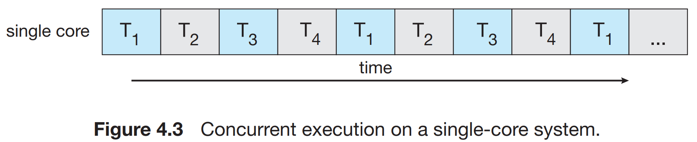
    
    - 다중 코어가 있는 시스템에서는 각 코어에 별도의 스레드를 할당하여 처리할 수 있다.
        
        ⇒ (병행성) 일부 스레드가 병렬로 실행될 수 있다.
        
    
    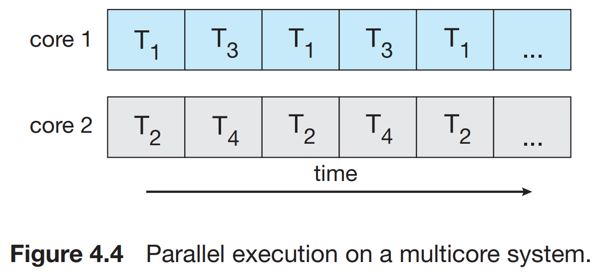
    

- 병행성과 병렬성의 차이점
    - **병행 시스템**은 모든 작업이 진행되게 하여 둘 이상의 작업을 지원한다.
    - **병렬 시스템**은 둘 이상의 작업을 동시에 수행할 수 있다.
        
        ┕ 병렬성 없이 병행성을 가질 수 있다.
        

### 4.2.1 프로그래밍 도전과제

- 일반적으로 다중 코어 시스템을 위해 프로그래밍하기 위해서는 5개의 극복해야할 도전과제가 있다.
1. **태스크 인식**
    
    :  응용을 분석하여 독립된 병행 가능 태스크로 나눌 수 있는 영역을 찾는 작업이 필요하다.
    
    ⇒ 이상적 태스크 : 독립된 태스크로써 개별 코어에서 병렬 실행되는 것
    
2. **균형**
    
    : 분석을 통해 찾은 태스크들이 전체 작업에 균등한 기여도를 가지도록 나누는 것이 중요하다.
    
3. **데이터 분리**
    
    : 태스크가 접근하고 조작하는 데이터를 개별 코어에서 사용할 수 있도록 나누어져야 한다.
    
4. **데이터 종속성**
    
    : 태스크가 접근하는 데이터는 둘 이상의 테스크 사이에 종속성이 없는지 검토되어야 한다.
    
5. **시험 및 디버깅**
    
    : 프로그램이 다중 코어에서 병렬로 실행될 때, 다양한 실행 경로가 존재할 수 있다. 따라서 그런 병행 프로그램을 실행하고 디버깅해야 한다.
    

### 4.2.2 병렬 실행의 유형

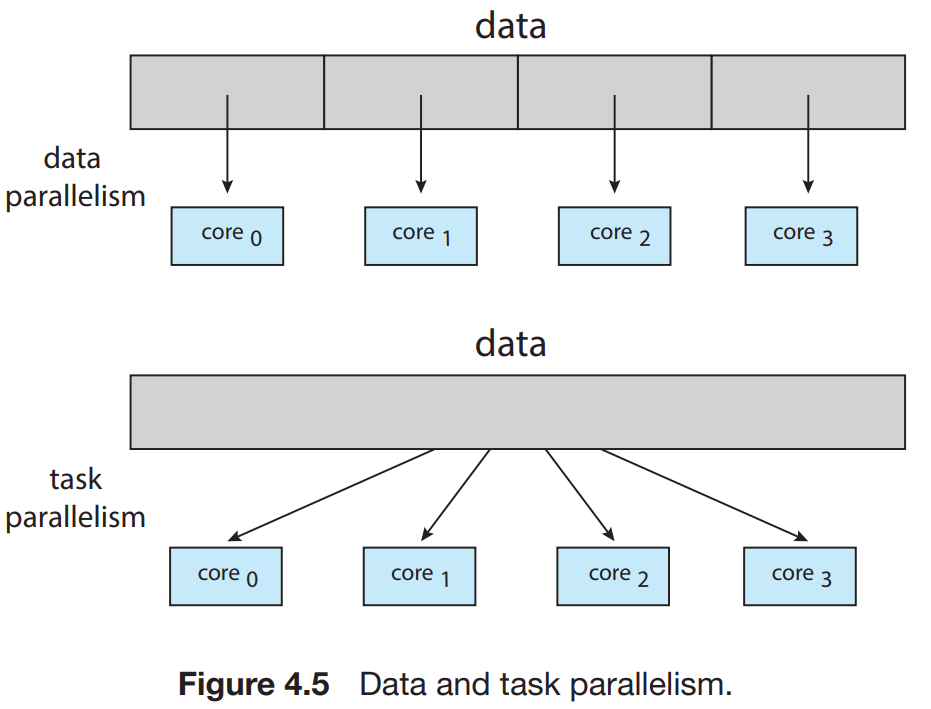

- 일반적으로 데이터 병렬 실행과 태스크 병렬 실행으로 나뉜다.
    - **데이터 병렬 실행**은 동일한 데이터 부분집합을 다수의 계산 코어에 분배한 뒤 각 코어에서 동일한 연산을 실행하는 데 초점을 맞춘다.
    - **태스크 병렬 실행**은 데이터가 아니라 태스크(스레드)를 다수의 코어에 분배한다.

- 기본적으로 데이터 병렬 처리에는 여러 코어에 데이터를 분배하는 것이 포함되고, 태스크 병렬처리에는 여러 코어에 태스크를 분배하는 것이 포함된다.
    - 그러나 데이터와 태스크 병렬 처리는 상호 배타적이지 않으며 실제로 응용 프로그램은 이 두가지 전략를 혼합하여 사용할 수 있다.

## 4.3 다중 스레드 모델

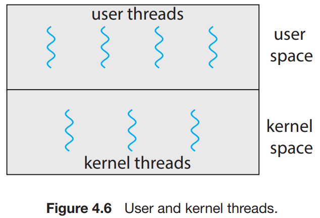

- 스레드를 위한 지원은 **사용자 스레드(user threads)를 위해서는 사용자 수준**에서, 또는 **커널 스레드(kernel threads)를 위해서는 커널 수준**에서 제공된다.
    - **사용자 스레드**는 커널 위에서 지원되며 커널의 지원 없이 관리된다.
    - **커널 스레드**는 운영체제에 의해 직접 지원되고 관리된다.
        
        ┕ Windows, Linux, MacOS를 포함한 거의 모든 운영체제들은 커널 스레드를 지원한다.
        

- 사용자 스레드와 커널 스레드는 연관 관계를 갖는 데, 일반적인 방법으로 다대일, 일대일, 다대다 모델이 있다.

### 4.3.1 다대일 모델

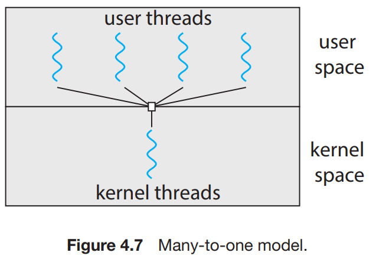

- **다대일(many-to-one) 모델**은 많은 사용자 수준 스레드를 하나의 커널 스레드로 매핑한다.
    - 스레드 관리는 사용자 공간의 스레드 라이브러리에 의해 행해진다.
    - 한 번에 하나의 스레드만이 커널에 접근할 수 있기 때문에, 다중 스레드가 다중 코어 시스템에서 병렬로 실행될 수 없다.

### 4.3.2 일대일 모델

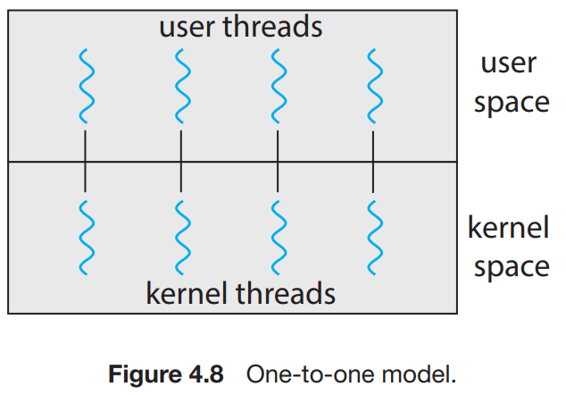

- **일대일(one-to-one) 모델**은 각 사용자 스레드를 각각 하나의 커널 스레드로 매핑한다.
    - 하나의 스레드가 봉쇄적 시스템 콜을 호출하더라도 다른 스레드가 실행될 수 있기 때문에 다대일 모델보다 더 많은 병렬성을 제공한다.
    - 다중 처리기에서 다중 스레드가 병렬로 수행되는 것을 허용한다.
    - 유일한 단점은 사용자 스레드를 만들려면 해당 커널 스레드를 만들어야 하며 많은 수의 커널 스레드가 시스템 성능에 부담을 줄 있다.
    - ex) Linux, Windows 등이 일대일 모델을 구현한다.

### 4.3.3 다대다 모델

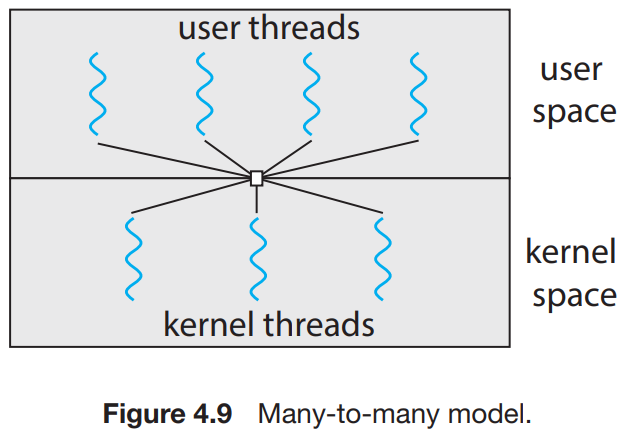

- **다대다(many-to-many) 모델**은 여러 개의 사용자 수준 스레드를 그보다 작은 수, 혹은 같은 수의 커널 스레드로 멀티플렉스 한다.
    - 커널 스레드의 수는 응용 프로그램이나 특정 기계에 따라 결정된다.

- 개발자는 필요한 만큼 많은 사용자 수준 스레드르 생성할 수 있다.
    - 그리고 상응하는 커널 스레드가 다중 처리기에서 병렬로 수행될 수 있다.
    - 또한, 스레드가 봉쇄형 시스템 콜을 발생시켰을 때, 커널이 다른 스레드의 수행을 스케줄 할 수 있다.

- 다대다 모델의 변형은 여전히 많은 사용자 스레드를 적거나 같은 수의 커널 스레드로 멀티 플렉스 시키지만, 한 사용자 스레드가 하나의 커널 스레드에만 연관되는 것을 허용한다.
    - 이 변형은 때로 **두 수준 모델(two-level-model)**이라고 불린다.
    
    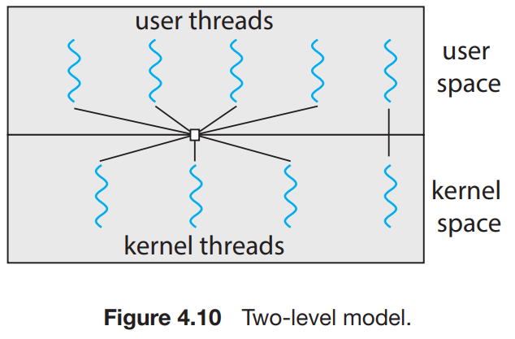
    

## 4.4 스레드 라이브러리

- **스레드 라이브러리**는 프로그래머에게 스레드를 생성하고 관리하기 위한 API를 제공한다.
    - 구현하는 방법 2가지
    1. 커널의 지원 없이 완전히 사용자 공간에서만 라이브러리를 제공하는 것
    2. 운영체제에 의해 지원되는 커널 수준 라이브러리를 구현하는 것

- 현재 POSIX Pthreads, Windows 및 Java의 세 종류 라이브러리가 주로 사용된다. (아래에서 설명)

- 다수의 스레드를 생성하는 일반적인 전략
    - **비동기 스레딩**은 부모가 자식 스레드를 생성한 후 부모는 자신의 실행을 재개하여 부모와 자식 스레드가 서로 독립적으로 병행하게 실행되는 스레딩 방식을 말한다.
        
        … 다중 스레드 서버에서 주로 사용
        
    - **동기 스레딩**은 부모 스레드가 하나 이상의 자식 스레드를 생성하고 자식 스레드 모두 종류할 때까지 기다렸다가 자신의 실행을 재개하는 방식을 말한다.
        
        … 스레드 사이의 상당한 양의 데이터 공유를 수반
        

**4.4.1 Pthreads**

- POSIX 표준안의 스레드 확장판인 Pthreads는 사용자 또는 커널 수준 라이브러리로서 제공된다.
    - 이것은 스레드의 동작에 관한 명세일 뿐이지 그것 자체를 구현한 것은 아니다.
    - Linux와 macOS를 포함한 많은 시스템이 Pthreads 명세를 구현하고 있다.
- Pthreads API를 사용하는 다중 스레드 C 프로그램
    
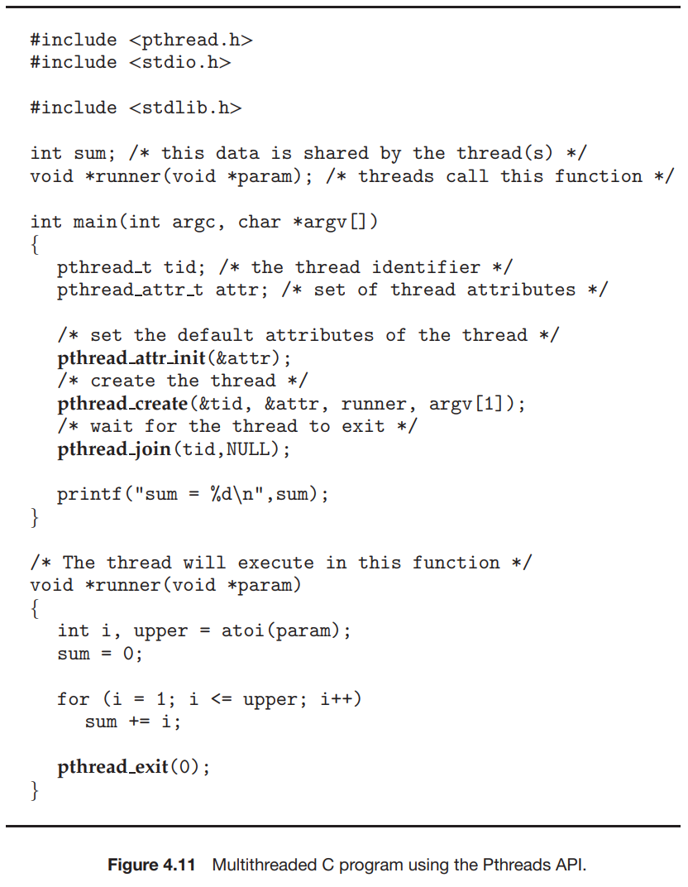
    

**4.4.2 Windows 스레드**

- Windows 스레드 라이브러리는 Windows 시스템에서 사용 가능한 커널 수준 라이브러리이다.
    - 이 스레드 라이브러리를 이용하여 스레드를 생성하는 기술은 많은 점에서 Pthreads 기법과 유사하다.
- Windows API를 사용한 다중 스레드 C 프로그램
    
    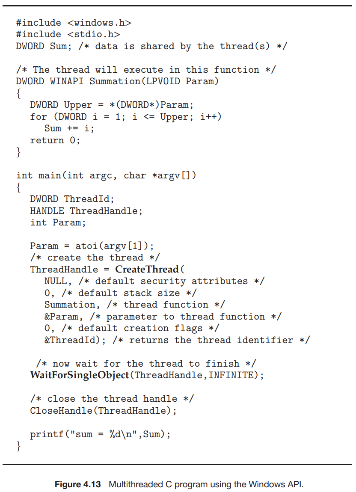
    

**4.4.3 Java 스레드**

- 스레드는 Java 프로그램의 프로그램 실행의 근본적인 모델이고, Java 언어와 API는 스레드의 생성과 관리를 지원하는 풍부한 특징을 제공한다.
- Java 스레드 API는 Java 프로그램에서 직접 스레드 생성과 관리를 가능하게 한다.
    - *모든 Java 프로그램은 적어도 하나의 단일 제어 스레드를 포함하고 있다.*
- Java Executor 프레임워크 API를 사용하는 예제 프로그램
    
    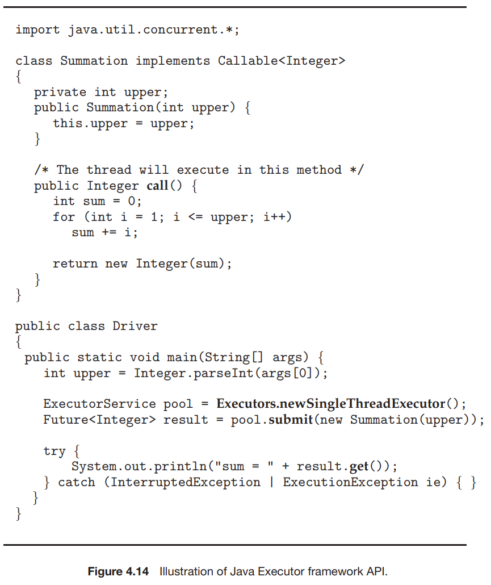

> ***JVM과 호스트 운영체제***

*JVM은 일반적으로 호스트 운영체제 위에서 구현된다. 이 설정을 통해 JVM은 하부 운영체제의 구현 세부 사항을 숨기고 Java 프로그램이 JVM을 지원하는 모든 플랫폼에서 작동할 수 있도록 일관되고 추상적인 환경을 제공할 수 있다. JVM 명세는 Java 스레드가 하부 운영체제에 매핑되는 방법을 명시하지 않고 대신 각 JVM의 구현에 맡긴다. 또한 Java 스레드 라이브러리와 호스트 운영체제의 스레드 라이브러리 간(Pthreads API, Windows API, …)에 관계가 있을 수 있다.*
> 

## 4.5 암묵적 스레딩

- 다중 코어 처리의 지속적 성장에 따라 수백 또는 수천 개의 스레드를 가진 응용이 등장하게 되었다.
- 많은 수의 스레드를 사용하느 어플리케이션의 병행 및 병렬 설계를 도와주는 한 가지 방법은 스레딩의 생성과 관리 책임을 어플리케이션 개발자로부터 컴파일러와 실행시간 라이브러리에게 넘겨주는 **암묵적 스레딩 기법**을 사용하는 것이다.
    - 암묵적 스레딩 전략은 일반적으로 응용 프로그램 개발자가 병렬로 실행할 수 있는 스레드가 아닌 작업을 식별해야 한다.
    - 즉, 암묵적 스레딩 전략에서 개발자는 병렬 작업만 식별하면 되고, 라이브러리는 스레드 생성 및 관리에 대한 특정 세부 사항을 결정하면 된다.

### 4.5.1 스레드 풀

- 다중 스레드 프로세스의 여러 문제점을 해결해 줄 수 있는 방법이 **스레드 풀(Thread pol)** 방법이다.

- 스레드 풀의 기본 아이디어는 프로세스를 시작할 때 아예 일정한 수의 스레드들을 미리 풀로 만들어두는 것이다.
    - 이 스레드들은 평소에 하는 일 없이 일감을 기다리게 된다.
    - 서버는 스레드를 생성하지 않고 요청을 받으면 스레드 풀에 제출하고 추가 요청 대기를 재개한다.
    - 풀에 사용가능한 스레드가 있으면 깨어나고 요청이 즉시 서비스 된다.
    - 스레드가 서비스를 완료하면 풀로 돌아가서 더 많은 작업을 기다린다.

- 스레드 풀의 장점
1. 새 스레드를 만들어 주기보다 기존 스레드로 서비스해 주는 것이 종종 빠르다.
2. 스레드 풀은 임의 시각에 존재할 스레드 개수에 제한을 둔다.
3. 태스크를 생성하는 방법을 태스크로부터 분리하면 태스크의 실행을 다르게 할 수 있다.

- Java에서 스레드 풀 생성하기
    
    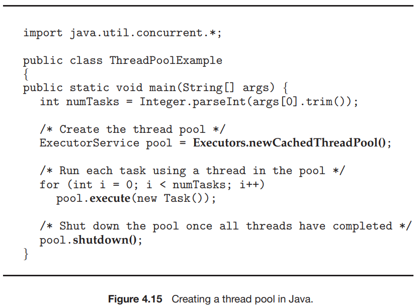

### 4.5.2 Fork Join

- **Fork-Join** 모델이란 동기식 모델의 암시적 스레딩에 사용된다면 라이브러리가 생성할 실제 스레드 수를 결정하는 동기 버전의 스레드 풀이다.

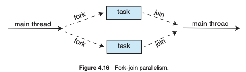

**4.5.2.1 Java에서 Fork Join**

- Java는 Quicksort 및 Mergesort와 같은 재귀 분할-정복 알고리즘과 함께 사용되도록 설계된 버전 1.7 API에 Fork join 라이브러리를 도입하였다.
    - 이 라이브러리를 사용하여 분할-정복 알고리즘을 구현할 때 분할 단계 동안 별도의 작업이 fork 되고 원래 문제의 작은 부분집합이 할당된다.

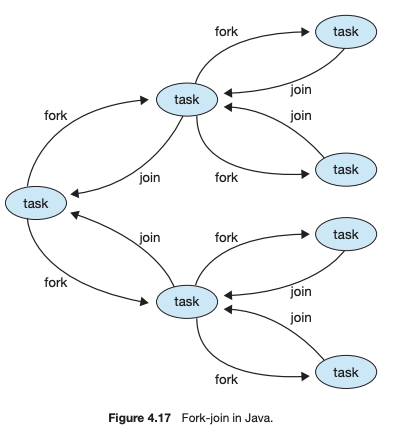

- Java의 fork-join 모델에서 흥미로운 점은 라이브러리가 작업자 스레드 풀을 생성하고 사용 가능한 작업자 간 부하의 균형을 조정하는 작업 관리에 있다.
- Java API를 사용한 fork-join 계산
    
    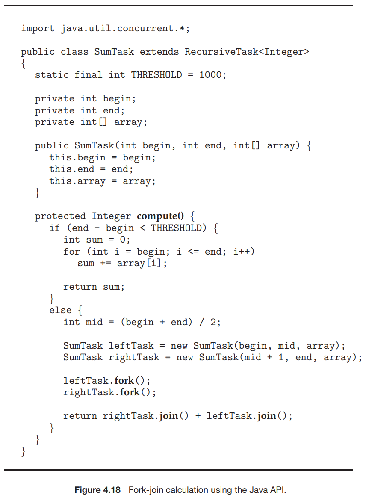

### 4.5.3 OpenMP

- **OpenMP**는 C, C++, FORTRAN으로 작성된 API와 컴파일러 디렉티브의 집합이다.
    - 공유 메모리 환경에서 병렬 프로그래밍을 할 수 있도록 도움을 준다.
    
- OpenMP는 병렬로 실행될 수 있는 블록을 찾아 **병렬 영역**(parallel regions) 이라고 부른다.

- OpenMP가 `#pragma omp parallel`과 같은 컴파일러 디렉티브를 만나게 되면 **시스템의 코어 개수만큼 스레드를 생성**한다.

- OpenMP는 병렬화를 위한 디렉티브를 제공할 뿐만 아니라 개발자가 병렬화 수준을 선택할 수 있게 한다.

### 4.5.4 Grand Central Dispatch

- **Grand Central Dispatch (GCD)**는 macOS 및 iOS 운영 체제를 위해 개발자가 병렬로 실행될 코드 섹션(태스크)을 식별할 수 있도록 하는 런타임 라이브러리, API 및 언어 확장의 조합이다.

- GCD는 실행시간을 위해 태스크를 **디스패치 큐**에 넣어서 스케줄한다.
    - 큐에서 태스크를 제거할 때 관리하는 스레드 풀에서 가용 스레드를 선택하여 태스크를 할당한다.

- GCD는 직렬과 병행의 두 가지 유형의 디스패치 큐를 유지한다.
    - 직렬 큐에 넣어진 태스크는 FIFO 순서대로 제거된다.
    - 병행 큐에 넣어진 태스크는 FIFO 순서로 제거되지만, 한 번에 여러 태스크가 제거되어 병렬로 실행될 수 있게 한다.

- 여러 시스템 전체의 병행 큐가 존재하며 4가지 주요 서비스 품질 클래스로 나뉜다.
    - **QOS_CLASS_USER_INTERACTIVE (사용자 대화형 클래스)**
        
        : 반응형 사용자 인터페이스를 보장하기 위하여 사용자와 상호작용하는 태스크를 나타낸다.
        
    - **QOS_CLASS_USER_INITIATED (사용자 시작 클래스)**
    : 태스크가 반응형 사용자 인터페이스와 관련되어 있어 사용자 대화형 클래스와 유사하나, 처리 시간이 더 오래 걸릴 수 있다.
    - **QOS_CLASS_UTILITY (유틸리티 클래스)**
    : 완료하는 데 시간이 오래 걸리지만 즉각적인 결과를 요구하지 않는 태스크를 나타낸다.
    - **QOS_CLASS_BACKGROUND (백그라운드 클래스)**
    : 사용자에게 보이지 않으며 시간에 민감하지 않다.

- 내부적으로 GCD의 스레드 풀은 POSIX 스레드로 구성된다.
    - GCD는 풀을 적극적으로 관리하여 응용 프로그램 요구 및 시스템 용량에 따라 스레드 수가 늘어나거나 줄어들게 한다.

## 4.6 스레드와 관련된 문제들

### 4.6.1 **Fork() 및 Exec() 시스템 콜**

- 3장에서 배웠던 **다중 스레드 프로그램에서 fork()와 exec()의 의미**에 대해서 생각해 보자.

1. 만일 한 프로그램의 스레드가 fork()를 호출하면 새로운 프로세스는 모든 스레드를 복제해야 하는가 아니면 한 개의 스레드만 가지는 프로세스여야 하는가?
    
    ⇒ UNIX 시스템은 fork() API로써 이 둘의 기능을 다 지원한다.
    
2. 보통 어떤 스레드가 exec() 시스템 콜을 부르면 exec()의 매개변수로 지정된 프로그램이 모든 스레드를 포함한 전체 프로세스를 대체시킨다.

⇒ *따라서, 우리는 운영체제에서 지원해주는 기능에 따라 적절히 fork()와 exec()를 사용해야 한다.*

### 4.6.2 신호 처리

- **신호**는 UNIX에서 프로세스에 어떤 이벤트가 일어났음을 알려주기 위해 사용된다.

- 신호는 비동기적, 동기적으로 발생할 수 있는데 이와 상관없이 모든 신호는 다음과 같은 형태로 전달되어야 한다.
    1. 신호는 특정 이벤트가 일어나야 생성된다.
    2. 생성된 신호가 프로세스에 전달된다.
    3. 신호가 전달되면 반드시 처리되어야 한다.
    
- 모든 신호는 아래 중 하나의 처리기에 의해 처리된다.
    1. **디폴트 신호 처리기** = 모든 신호마다 커널이 실행시킨다.
    2. **사용자 정의 신호 처리기** = 신호를 처리하기 위해 호출되는 처리기이다.

- 신호를 전달하는 방법은 신호의 유형에 따라 다르다.
    
    ex) 프로세스가 여러 스레드를 가지고 있는 경우,
    
    - 동기식 신호는 그 신호를 야기한 스레드에 전달되어야 하고, 다른 스레드에 전달되면 안된다.
    - 비동기 신호는 그 프로세스 내 모든 스레드에 전달되어야 한다.

### 4.6.3 스레드 취소

- **스레드 취소** (thread cancellation)는 스레드가 끝나기 전에 그것을 강제 종료시키는 작업을 말한다.
    
    *ex) 여러 스레드가 데이터베이스를 병렬로 검색하고 있다가 그 중 한 스레드가 결과를 찾았다면 나머지 스레드는 취소 되어야 하는 경우 → 강제 종료*
    
- 위 예시처럼 취소되어야 할 스레드를 **목적 스레드** (target therad) 라고 부른다.
    - 목적 스레드의 취소 2가지 방식
    1. **비동기식 취소** : 한 스레드가 즉시 목적 스레드를 강제 종료 시킨다.
    2. **지연 취소** : 목적 스레드가 주기적으로 자신이 강제 종료 되어야 할 지를 점검한다.
    … 질서 정연하게 강제 종료 가능

- 스레드 취소를 어렵게 만드는 것은 *취소 스레드들에 할당된 자원의 문제가 가장 크기 때문*에 이를 잘 고려해서 스레드 취소를 해야 한다.

- Pthreads에서는 pthread_cancel() 함수를 사용하여 스레드를 취소할 수 있다.
    - pthread_cancel()을 호출하면 대상 스레드를 취소하라는 요청만 표시된다.
    - 그러나 실제 취소는 요청을 처리하기 위해 대상 스레드가 설정되는 방식에 달려 있다.
    - 대상 스레드가 최종적으로 취소되면 취소 스레드의 pthread_join() 호출이 반환된다.

- Pthreads는 아래와 같이 3가지 취소 모드를 지원한다.

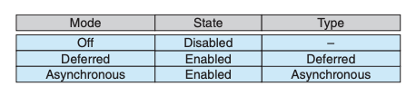

- 기본 스레드 취소 유형은 지연 취소 (deferred) 이다.
    - 즉, 스레드가 **취소 점**에 도달한 경우에만 취소가 발생한다.
- Pthreads는 스레드가 취소될 때 **정리 핸들러(clean handler)**라고 하는 함수가 호출되게 할 수 있다.
    - 이 기능을 사용하면 스레드가 종료되기 전에 획득한 모든 자원을 해제할 수 있는 함수를 제공한다.
- Java의 스레드 취소는 Pthread의 지연 취소와 유사한 정책을 사용한다.

### 4.6.4 스레드-로컬 저장장치

- 한 프로세스에 속한 스레드들은 그 프로세스의 데이터를 스레드간에 모두 공유한다.
    - 하지만 상황에 따라서는 각 스레드가 자기만 액세스할 수 있는 데이터를 가져야 할 필요도 있다. ****그러한 데이터를 **스레드-로컬 저장장치(thread-local storage, TLS)** 라고 부른다.
    
    *ex) 트랜잭션 처리 시스템에서 각 트랜잭션을 독립된 스레드가 처리해 준다고 가정할 때 스레드마다 고유한 식별자를 연관시키기 위해서는 TLS가 있어야만 한다.*
    

### 4.6.5 스케줄러 액티베이션

- 다대다(many to many) or 두 수준 모델(two level model)을 구현하는 많은 시스템은 사용자와 커널 스레드 사이에 중간 자료 구조를 둔다.
    - 이 구조는 통상 **경량 프로세스** 또는 **LWP**라고 불리며 아래 그림과 같다.
    
    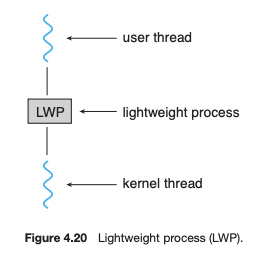
    

- LWP 방식 설명
    - 사용자 스레드 라이브러리에 LWP 방식은 어플리케이션이 사용자 스레드를 수행하기 위하여 스케줄 할 가상 처리기(virtual processor)처럼 보인다.
    - 각 LWP는 하나의 커널 스레드에 부속되어 있으며 Processor가 스케줄 하는 대상은 바로 이 커널 스레드이다.
    
- 사용자 스레드 라이브러리와 커널 스레드 간의 통신 방법의 하나는 **스케줄러 액티베이션**이라고 알려진 방법이다.
    - 커널은 어플리케이션에 LWP의 집합을 제공하고 어플리케이션은 사용자 스레드를 가용한 가상 처리기(LWP)로 스케줄 한다.
    - 커널은 어플리케이션에 특정 이벤트에 대해 알려줘야 한다. 이 프로시저를 **upcall**이라고 부른다.
    
- **Upcall**은 스레드 라이브러리의 upcall 처리기에 의해 처리되고, **upcall 처리기**는 가상 처리기상에서 실행되어야 한다.

## 4.7 운영체제 사례

### 4.7.1 Windows 스레드

- Windows 어플리케이션들은 프로세스 형태로 실행되며 이들 각 프로세스는 한개 또는 그 이상의 스레드를 가질 수 있다.
    - Windows는 사용자 수준 스레드 하나마다 커널 스레드 하나가 맵핑되는 일대일 대응을 사용한다.
    
- 스레드의 일반적인 구성요소는 다음과 같다.
    - 각 스레드를 유일하게 지목하는 스레드 ID
    - 처리기의 상태를 나타내는 레지스터 집합
    - 프로그램 카운터(PC)
    - 사용자 모드에서 실행될 때 필요한 사용자 스택, 커널 모드에서 실행될 때 필요한 커널 스택
    - 실행 시간 라이브러리와 동적 링크 라이브러리(DLL) 등이 사용하는 개별 데이터 저장 영역
    
- 스레드의 주요 자료 구조는 다음과 같다.
    - **ETHREAD — 실행 스레드 블록(executive thread block)**
        - 스레드가 속한 프로세스를 가리키는 포인터와 스레드가 실행을 시작해야 할 루틴의 주소 등이 있다.
        - ETHREAD는 KTHREAD에 대한 포인터도 가지고 있다.
    - **KTHREAD — 커널 스레드 블록(kernel thread block)**
        - 스레드의 스케줄링 및 동기화 정보를 가지고 있다.
        - 커널 모드에서 실행될 때 사용되는 커널 스택과 TEB에 대한 포인터를 가지고 있다.
    - **TEB — 스레드 환경 블록(thread environment block)**
        - 스레드 식별자, 사용자 모드 스택 및 TLS를 위한 배열을 가지고 있다.
    
- ETHREAD와 KTHREAD는 모두 커널 안에 존재하지만 TEB는 사용자 모드에서 실행될 때 접근되는 사용자 공간 자료 구조이다.

- 아래의 그림은 Windows 스레드의 구조를 나타낸 그림이다.

### 4.7.2 Linux 스레드

- Linux는 프로세스와 스레드를 구별하지 않는다.
    - 사실 Linux는 프로그램 내의 제어 흐름을 나타내기 위하여 프로세스나 스레드보다는 **태스크**라는 용어를 사용한다
    
- clone()이 호출될 때 부모와 자식 태스크가 자료구조를 얼마나 공유할지 결정하는 플래그의 집합이 전달된다. 이는 아래의 그림과 같다.

- Linux 커널이 태스크를 표현하는 방식 때문에 다양한 공유 수준이 가능하다.
    - 시스템의 태스크마다 고유한 커널 자료구조가(struct task_struct) 존재한다.
    - 이 자료구조는 태스크의 데이터를 저장하는 것이 아니라 데이터가 저장된 다른 자료구조를 가리키는 포인터를 포함한다.
    - 이러한 태스크를 표현하는 방식 때문에 clone()을 사용해서 태스크간에 다양한 공유 수준이 가능하다.
    - 또한 clone() 시스템 콜의 융통성은 컨테이너 개념으로 확장될 수 있다.
